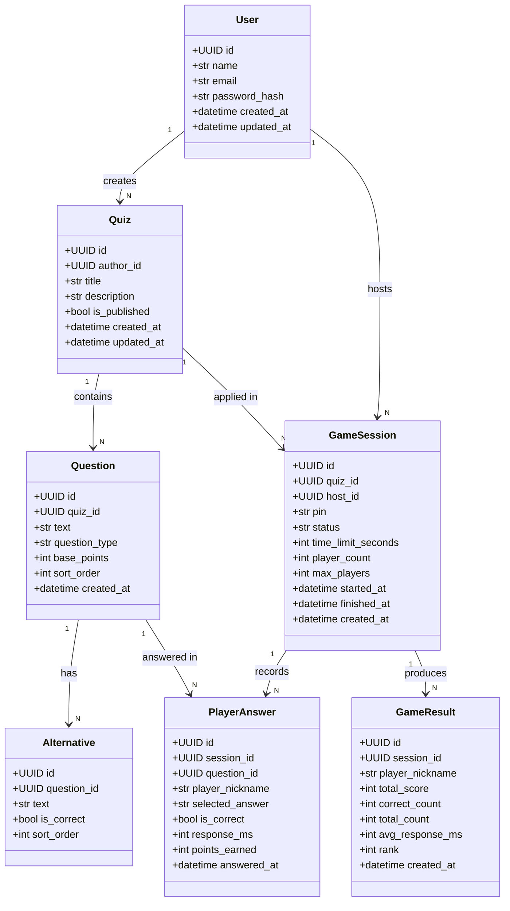
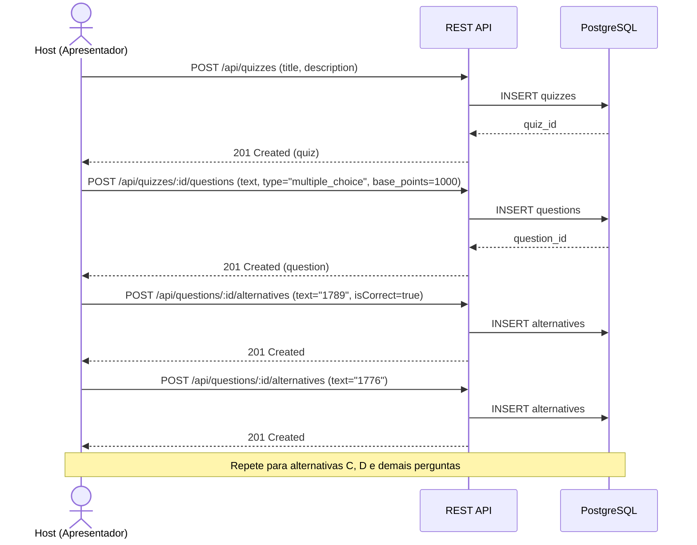
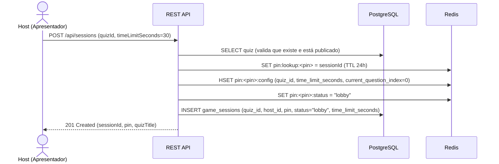
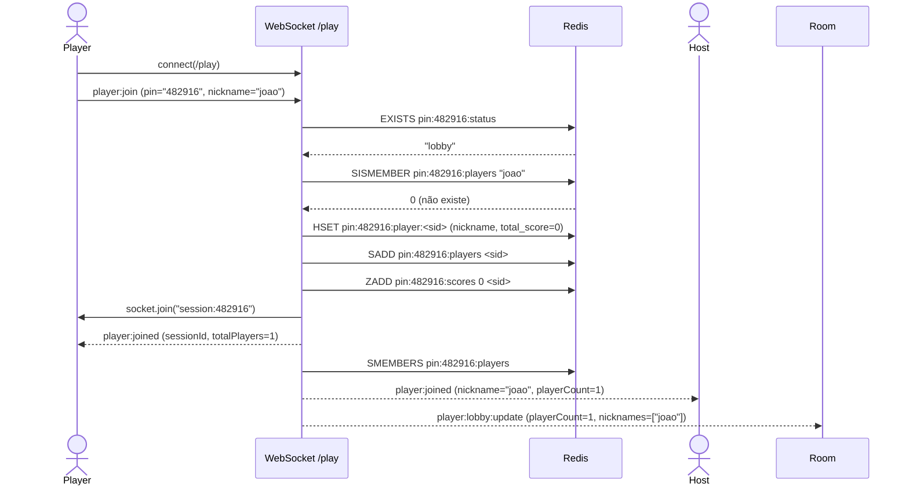
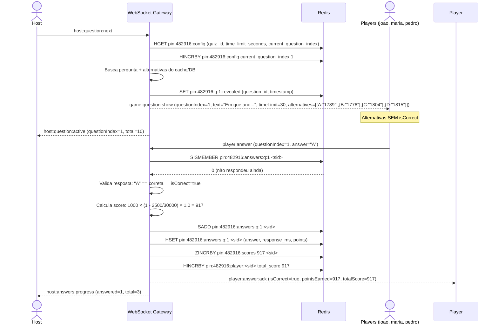
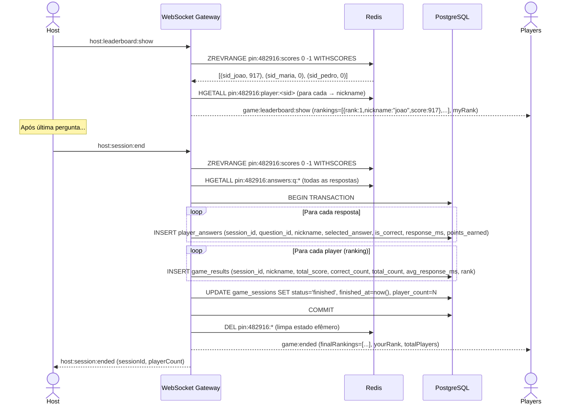
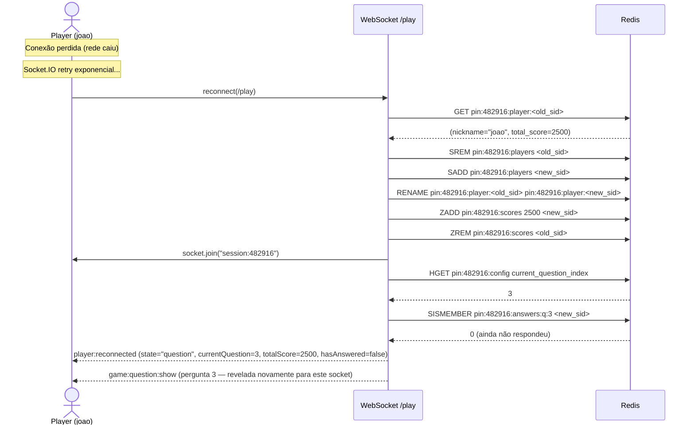

# Documentação de Requisitos — Plataforma Interativa de Quizzes em Tempo Real

**Versão:** 1.0

**Status:** Em revisão

**Data:** 2026-06-20

---

## Sumário

1. [Objetivo do Sistema](#1-objetivo-do-sistema)
2. [Glossário de Domínio](#2-glossário-de-domínio)
3. [Arquitetura e Fronteiras do Sistema](#3-arquitetura-e-fronteiras-do-sistema)
4. [Papéis e Permissões (RBAC)](#4-papéis-e-permissões-rbac)
5. [Requisitos Funcionais](#5-requisitos-funcionais)
   - 5.1 [Gestão de Quizzes](#51-gestão-de-quizzes)
   - 5.2 [Gestão de Perguntas e Alternativas](#52-gestão-de-perguntas-e-alternativas)
   - 5.3 [Lobby e Sessão de Jogo](#53-lobby-e-sessão-de-jogo)
   - 5.4 [Gameplay em Tempo Real](#54-gameplay-em-tempo-real)
   - 5.5 [Sistema de Pontuação](#55-sistema-de-pontuação)
   - 5.6 [Leaderboard](#56-leaderboard)
   - 5.7 [Histórico e Relatórios](#57-histórico-e-relatórios)
6. [Requisitos Não Funcionais](#6-requisitos-não-funcionais)
7. [Regras de Negócio](#7-regras-de-negócio)
8. [Critérios de Aceitação](#8-critérios-de-aceitação)
9. [Fora de Escopo](#9-fora-de-escopo)
10. [Decisões Pendentes](#10-decisões-pendentes)
11. [Diagrama de Classes](#11-diagrama-de-classes)
12. [Diagramas de Sequência](#12-diagramas-de-sequência)
13. [Mapa do Site](#13-mapa-do-site)

---

## 1. Objetivo do Sistema

O sistema tem como objetivo viabilizar uma plataforma interativa de quizzes em tempo real, no estilo Kahoot!, onde um Apresentador (Host) autenticado cria questionários, gerencia perguntas e conduz sessões ao vivo, enquanto Participantes (Players) anônimos entram via PIN de 6 dígitos usando seus próprios dispositivos móveis ou computadores.

A plataforma é **single-tenant** na versão 1.0: cada instância atende a um único público (ex: uma escola, uma empresa). O foco está na experiência de jogo em tempo real com baixa latência e na reutilização de questionários como templates em múltiplas sessões.

O sistema expõe APIs REST para o painel do Host e utiliza WebSockets para toda a comunicação em tempo real com os Players.

---

## 2. Glossário de Domínio

| Termo                                 | Definição                                                                                                                                                 |
| ------------------------------------- | --------------------------------------------------------------------------------------------------------------------------------------------------------- |
| **Host (Apresentador)**               | Usuário autenticado que cria quizzes, gerencia perguntas, inicia sessões de jogo e projeta a tela principal.                                              |
| **Player (Participante)**             | Usuário anônimo que entra em uma sessão ativa através de um PIN de 6 dígitos usando seu próprio dispositivo, sem necessidade de criar conta.              |
| **Quiz (Questionário)**               | Template de perguntas criado pelo Host. Pode ser reutilizado em múltiplas sessões de jogo. Contém título, descrição e uma lista ordenada de perguntas.    |
| **Pergunta (Question)**               | Item individual do quiz. Pode ser de múltipla escolha (A/B/C/D) ou verdadeiro/falso (T/F). Possui pontuação base configurável.                            |
| **Alternativa (Alternative)**         | Opção de resposta de uma pergunta. Apenas uma é marcada como correta. O gabarito nunca é exposto ao Player antes do timeout.                              |
| **Sessão de Jogo (Game Session)**     | Uma "aplicação" de um quiz. Possui PIN único de 6 dígitos, tempo limite de resposta configurável por sessão, e ciclo de vida: lobby → playing → finished. |
| **PIN**                               | Código numérico de 6 dígitos gerado aleatoriamente. Identificador público da sessão. Players usam o PIN + um nickname para entrar.                        |
| **Lobby**                             | Estado inicial da sessão onde Players aguardam. O Host vê a contagem de participantes e seus nicknames em tempo real.                                     |
| **Gameplay**                          | Fase ativa do jogo: o Host avança perguntas, Players respondem, o sistema calcula pontuações.                                                             |
| **Leaderboard**                       | Ranking dos jogadores exibido entre perguntas e ao final da partida. Ordenado por pontuação total decrescente.                                            |
| **Pontuação (Score)**                 | Calculada pelo backend com base na precisão (resposta correta) e na velocidade de resposta (tempo de reação).                                             |
| **Tempo de Resposta (Response Time)** | Milissegundos entre o momento em que a pergunta é revelada e o momento em que o Player envia sua resposta.                                                |
| **Reconexão**                         | Mecanismo que permite um Player que desconectou brevemente reconectar-se à mesma sessão sem perder sua pontuação acumulada.                               |

---

## 3. Arquitetura e Fronteiras do Sistema

### 3.1 Posicionamento do Sistema

A plataforma é responsável por:

- Autenticação e gerenciamento de Hosts (registro, login, JWT)
- CRUD completo de quizzes, perguntas e alternativas
- Geração de PINs únicos e gerenciamento do ciclo de vida da sessão
- Comunicação em tempo real (WebSocket) entre Host, servidor e Players
- Cálculo de pontuação no backend (anti-trapaça)
- Gerenciamento de leaderboard em tempo real
- Reconexão com restauração de estado
- Persistência de resultados para relatórios

A plataforma **não é responsável por**:

- Processamento de pagamentos (não há planos pagos na v1.0)
- Upload de mídia nas perguntas ( somente texto na v1.0)
- Integração com LMS ou sistemas escolares externos

### 3.2 Integrações Externas

| Sistema Externo | Tipo de Integração | Responsabilidade            |
| --------------- | ------------------ | --------------------------- |
| Nenhum na v1.0  | —                  | A plataforma é autocontida. |

### 3.3 Modelo de Comunicação

```
┌─────────────────────────────────────────────────────────┐
│                     Nginx (Reverse Proxy)                │
│              SSL Termination / WebSocket Upgrade         │
└────────┬──────────────┬──────────────┬──────────────────┘
         │              │              │
    REST API      WebSocket        Static Files
    (/api/*)      (Socket.IO)      (SvelteKit)
         │              │              │
         ▼              ▼              ▼
┌─────────────────────────────────────────────────────────┐
│                   Node.js + TypeScript                   │
│                                                         │
│  REST (Fastify)  │  WebSocket Gateway (Socket.IO)       │
│  • Auth          │  • /host namespace (autenticado)     │
│  • Quiz CRUD     │  • /play namespace (anônimo + PIN)   │
│  • Reports       │  • Scoring Engine                    │
│                  │  • Leaderboard Service               │
└────────┬──────────────────────────────┬────────────────┘
         │                              │
         ▼                              ▼
┌─────────────────┐          ┌─────────────────────┐
│   PostgreSQL     │          │       Redis          │
│  (persistente)   │          │  (estado efêmero)    │
└─────────────────┘          └──────────────────────┘
```

---

## 4. Papéis e Permissões (RBAC)

### 4.1 Host (Apresentador)

| Ação                                             | Permitido |
| ------------------------------------------------ | --------- |
| Registrar-se e fazer login                       | ✅        |
| Criar, editar e excluir quizzes                  | ✅        |
| Adicionar, editar, remover e reordenar perguntas | ✅        |
| Adicionar, editar e remover alternativas         | ✅        |
| Marcar alternativa correta                       | ✅        |
| Criar sessão de jogo a partir de um quiz         | ✅        |
| Iniciar, avançar e encerrar sessão               | ✅        |
| Visualizar leaderboard durante e após a partida  | ✅        |
| Acessar relatórios dos seus quizzes e sessões    | ✅        |
| Acessar quizzes de outros Hosts                  | ❌        |
| Entrar como Player na própria sessão             | ❌        |

### 4.2 Player (Participante)

| Ação                                                   | Permitido |
| ------------------------------------------------------ | --------- |
| Entrar em sessão ativa via PIN + nickname              | ✅        |
| Visualizar perguntas conforme reveladas pelo Host      | ✅        |
| Enviar resposta dentro do tempo limite                 | ✅        |
| Visualizar feedback individual (certo/errado + pontos) | ✅        |
| Visualizar leaderboard entre perguntas e pódio final   | ✅        |
| Reconectar-se à sessão após desconexão                 | ✅        |
| Criar ou editar quizzes                                | ❌        |
| Iniciar ou controlar uma sessão                        | ❌        |
| Ver respostas de outros Players                        | ❌        |
| Ver gabarito antes do timeout                          | ❌        |

---

## 5. Requisitos Funcionais

### 5.1 Gestão de Quizzes

**RF-01** — O sistema deve permitir que o Apresentador crie questionários, informando obrigatoriamente um título e opcionalmente uma descrição.

**RF-02** — O sistema deve permitir que o Apresentador edite o título e a descrição dos seus questionários a qualquer momento.

**RF-03** — O sistema deve permitir que o Apresentador exclua questionários de sua autoria. A exclusão pode ser definitiva ou manter os dados para consulta futura.

**RF-04** — O sistema deve listar todos os questionários do Apresentador autenticado, permitindo navegação por páginas quando houver muitos registros.

**RF-05** — Um questionário é um modelo reutilizável: o mesmo questionário pode ser aplicado em múltiplas partidas independentes.

**RF-06** — O Apresentador pode publicar ou despublicar um questionário. Questionários não publicados ficam ocultos e não podem ser utilizados para iniciar uma partida.

---

### 5.2 Gestão de Perguntas e Alternativas

**RF-07** — O sistema deve permitir adicionar perguntas a um questionário. Cada pergunta possui: texto, tipo (múltipla escolha ou verdadeiro/falso), pontuação máxima e posição na ordem de exibição.

**RF-08** — Perguntas de múltipla escolha devem ter entre duas e quatro opções de resposta. Perguntas de verdadeiro/falso devem ter exatamente duas opções (Verdadeiro e Falso).

**RF-09** — O sistema deve permitir editar o texto e o tipo de qualquer pergunta, bem como excluí-la do questionário.

**RF-10** — O sistema deve permitir alterar a ordem das perguntas dentro de um questionário.

**RF-11** — Cada pergunta deve ter no mínimo duas opções de resposta. Para perguntas de verdadeiro/falso, exatamente duas. Para múltipla escolha, entre duas e quatro.

**RF-12** — O sistema deve permitir adicionar, editar e remover opções de resposta de uma pergunta.

**RF-13** — Exatamente uma opção de resposta por pergunta deve ser marcada como correta. Ao marcar uma nova opção como correta, a marcação anterior é removida automaticamente.

---

### 5.3 Entrada e Sessão de Jogo

**RF-14** — O sistema deve gerar um código de acesso (PIN) de 6 dígitos numéricos, aleatório e imprevisível, sempre que o Apresentador criar uma partida a partir de um questionário.

**RF-15** — O código de acesso deve ser único entre todas as partidas que estejam em andamento (abertas ou com perguntas ativas). Códigos de partidas já encerradas podem ser reutilizados.

**RF-16** — O Apresentador define o tempo máximo de resposta, em segundos, ao abrir a partida. Esse valor pode variar entre 5 segundos e 5 minutos e se aplica igualmente a todas as perguntas daquela partida.

**RF-17** — Uma partida possui três estágios: Aguardando (os Participantes podem entrar), Em Andamento (as perguntas estão sendo exibidas) e Encerrada (a partida terminou).

**RF-18** — No estágio Aguardando, os Participantes podem entrar na partida informando o código de acesso e um apelido. O Apresentador visualiza a lista de apelidos e a quantidade de participantes presentes, com atualização em tempo real.

**RF-19** — O apelido deve ser único dentro da partida. Se um Participante tentar entrar com um apelido já em uso, sua entrada deve ser recusada com uma mensagem informativa.

**RF-20** — O Apresentador decide quando iniciar a partida, passando-a do estágio Aguardando para Em Andamento. Após o início, novos Participantes não podem mais entrar.

**RF-21** — O Apresentador decide quando encerrar a partida, passando-a do estágio Em Andamento para Encerrada, tipicamente após a última pergunta.

**RF-22** — Ao encerrar a partida, o sistema deve armazenar definitivamente todos os resultados (respostas de cada Participante, pontuações e a classificação final). As informações temporárias mantidas durante o jogo ao vivo devem ser descartadas.

---

### 5.4 Andamento da Partida em Tempo Real

**RF-23** — O Apresentador controla manualmente o avanço das perguntas. Ao comandar a próxima pergunta, ela deve ser exibida simultaneamente para todos os Participantes conectados.

**RF-24** — As opções de resposta exibidas aos Participantes não devem conter indicação de qual é a correta. O gabarito só é revelado a todos após o encerramento da janela de respostas daquela pergunta — seja por esgotamento do tempo ou porque todos já responderam.

**RF-25** — Cada Participante pode enviar exatamente uma resposta por pergunta. Uma vez enviada, a resposta é definitiva. Tentativas adicionais na mesma pergunta devem ser ignoradas.

**RF-26** — O sistema deve exibir ao Apresentador, em tempo real, o progresso de respostas: quantos Participantes já responderam em relação ao total presente na partida.

**RF-27** — Quando o tempo limite da pergunta se esgota, o sistema automaticamente encerra a janela de respostas, revela a opção correta a todos e divulga as pontuações daquela rodada.

**RF-28** — A exibição das perguntas deve ser sincronizada: o texto e as opções de resposta devem aparecer nos dispositivos dos Participantes simultaneamente, com atraso inferior a meio segundo em condições normais de conexão.

**RF-29** — Após cada resposta, o sistema deve exibir ao Participante: se acertou ou errou, quantos pontos ganhou naquela pergunta e qual sua pontuação total acumulada na partida.

---

### 5.5 Sistema de Pontuação

**RF-30** — A pontuação de cada Participante em uma pergunta é determinada por três fatores:

- A **pontuação-base** da pergunta, definida pelo Apresentador ao criá-la (padrão: 1000 pontos);
- A **velocidade de resposta**: quanto mais rápido o Participante responder, maior a parcela da pontuação-base que ele recebe. A relação é linear: uma resposta instantânea e correta vale 100% da pontuação-base; uma resposta correta no último instante do tempo limite vale uma fração mínima;
- A **precisão**: se o Participante acertar, recebe a pontuação calculada; se errar, recebe zero.

**RF-31** — Nenhuma pergunta pode gerar pontuação negativa. O piso de pontuação por pergunta é zero.

**RF-32** — A pontuação total de um Participante ao longo da partida é a soma das pontuações obtidas em cada pergunta.

**RF-33** — O Participante que não enviar resposta dentro do tempo limite recebe zero pontos naquela pergunta.

---

### 5.6 Classificação (Leaderboard)

**RF-34** — O sistema deve exibir a classificação dos dez melhores Participantes após cada pergunta (classificação parcial).

**RF-35** — O sistema deve exibir a classificação final completa de todos os Participantes ao término da partida.

**RF-36** — A classificação deve mostrar: posição, apelido, pontuação total e quantidade de acertos de cada Participante.

**RF-37** — Cada Participante deve ver sua própria posição em destaque na classificação, mesmo que esteja fora dos dez primeiros colocados.

**RF-38** — A classificação deve refletir as pontuações em tempo real e ser atualizada imediatamente após cada rodada de respostas.

---

### 5.7 Histórico e Relatórios

**RF-39** — O sistema deve registrar cada resposta individual ao final da partida, contendo: partida, pergunta, apelido do Participante, opção escolhida, se acertou, tempo de resposta e pontos obtidos.

**RF-40** — O sistema deve registrar o resultado final de cada partida, contendo: classificação, pontuação total, total de acertos, total de perguntas e tempo médio de resposta de cada Participante.

**RF-41** — O Apresentador deve poder consultar relatórios por questionário, incluindo: taxa de acerto por pergunta, tempo médio de resposta por pergunta e identificação das questões com maior índice de erro.

**RF-42** — O Apresentador deve poder consultar o histórico de partidas de um questionário, incluindo: data, código de acesso, número de Participantes, pontuação média e vencedor de cada partida.

**RF-43** — O Apresentador deve poder consultar o relatório detalhado de uma partida específica, incluindo: respostas de cada Participante por pergunta e a classificação final completa.

---

## 6. Requisitos Não Funcionais

### 6.1 Desempenho e Capacidade

**RNF-01** — O intervalo entre o comando do Apresentador para exibir uma pergunta e sua aparição nos dispositivos de todos os Participantes não deve ultrapassar meio segundo em condições normais de conexão.

**RNF-02** — O sistema deve suportar até quinhentos Participantes simultâneos em uma mesma partida.

**RNF-03** — O intervalo entre o envio de uma resposta pelo Participante e a confirmação de recebimento não deve ultrapassar duzentos milissegundos em condições normais de conexão.

**RNF-04** — A classificação dos Participantes deve ser exibida em tempo real, sem atraso perceptível, independentemente da quantidade de jogadores na partida.

### 6.2 Disponibilidade e Tolerância a Falhas

**RNF-05** — Se um Participante perder a conexão temporariamente, ele deve poder retornar à mesma partida em até trinta segundos sem perder sua pontuação acumulada nem seu apelido.

**RNF-06** — As informações da partida em andamento (participantes presentes, pontuações, pergunta atual) devem ser mantidas de forma que, em caso de interrupção inesperada, possam ser recuperadas.

**RNF-07** — O sistema deve separar as informações de uma partida ao vivo (voláteis, de curta duração) dos dados permanentes (questionários, resultados finais, histórico). Nenhuma informação permanente pode ser perdida por falha durante uma partida.

### 6.3 Segurança e Privacidade

**RNF-08** — As credenciais de acesso dos Apresentadores devem ser armazenadas de forma protegida, utilizando técnica de embaralhamento irreversível reconhecida como segura.

**RNF-09** — O acesso do Apresentador deve expirar automaticamente após um período curto de inatividade. O sistema deve oferecer um mecanismo seguro de renovação de acesso sem exigir nova digitação de credenciais.

**RNF-10** — O código de acesso (PIN) da partida deve ser gerado de forma aleatória e imprevisível, sem seguir padrões sequenciais ou baseados em dados da partida.

**RNF-11** — Em nenhum momento as opções de resposta exibidas ao Participante devem conter a indicação de qual é a correta. O gabarito somente é revelado após o fechamento da janela de respostas da pergunta.

**RNF-12** — Questionários completos com seus respectivos gabaritos devem ser acessíveis apenas pelo Apresentador que os criou. Nenhum Participante ou outro Apresentador pode ter acesso ao gabarito.

**RNF-13** — O sistema deve limitar a quantidade de tentativas repetidas em operações sensíveis, especialmente no acesso a partidas por código e na autenticação de Apresentadores, para impedir varredura ou adivinhação.

**RNF-14** — Mensagens de erro exibidas aos usuários finais não devem revelar detalhes técnicos de implementação ou de infraestrutura.

### 6.4 Auditoria e Registro

**RNF-15** — Toda resposta de Participante deve ser registrada com data e hora exatas, permitindo a auditoria completa de cada partida.

**RNF-16** — Toda alteração em questionários (criação, edição, exclusão) deve registrar o Apresentador responsável e o momento da alteração.

---

## 7. Regras de Negócio

### RN-01 — Questionário como Template

Um questionário (quiz) é independente da sua aplicação em uma partida. O mesmo questionário pode ser aplicado em múltiplas partidas com configurações diferentes, como tempo limite, data e público. Cada partida gera seus próprios resultados, sem alterar o questionário original nem os resultados de partidas anteriores.

### RN-02 — PIN Único por Partida em Andamento

O PIN de 6 dígitos identifica uma partida. Enquanto uma partida estiver em andamento (aberta para entrada ou com perguntas ativas), o PIN é exclusivo e não pode ser reutilizado. Ao término da partida, o PIN é liberado e pode ser gerado novamente para outra partida.

### RN-03 — Um Questionário, Múltiplas Partidas

Uma partida está vinculada a exatamente um questionário. Um questionário pode ter múltiplas partidas. Alterações feitas no questionário após a realização de uma partida não afetam os resultados já registrados — os resultados da partida refletem as perguntas e alternativas exatamente como estavam no momento em que a partida foi iniciada.

### RN-04 — Resposta Única por Jogador

Cada Participante pode responder no máximo uma vez a cada pergunta. Uma vez enviada, a resposta é definitiva e não pode ser alterada. Tentativas de responder novamente à mesma pergunta devem ser ignoradas.

### RN-05 — Tempo Limite Definido na Partida

O tempo máximo para responder cada pergunta é definido pelo Apresentador no momento em que a partida é iniciada. Esse tempo se aplica igualmente a todas as perguntas daquela partida, independentemente da pontuação ou do conteúdo de cada pergunta.

### RN-06 — Pontuação Proporcional à Velocidade

Quanto mais rápido o Participante responder corretamente, maior será sua pontuação naquela pergunta. A pontuação máxima possível é atingida com uma resposta instantânea e correta; a pontuação mínima para um acerto ocorre quando a resposta é enviada no último instante do tempo limite. A relação entre tempo e pontuação é linearmente decrescente.

### RN-07 — Resposta Errada ou Sem Resposta Não Pontua

Responder incorretamente ou não responder dentro do tempo limite resulta em zero pontos naquela pergunta. Nenhuma pergunta pode gerar pontuação negativa — o piso é sempre zero.

### RN-08 — Apelido Único por Partida

Dentro de uma partida, cada Participante deve usar um apelido (nickname) que o identifique unicamente. Dois Participantes não podem usar o mesmo apelido na mesma partida, desconsiderando-se diferenças entre letras maiúsculas e minúsculas. Caso um Participante tente entrar com um apelido já em uso, sua entrada deve ser recusada.

### RN-09 — Ciclo de Vida da Partida

Uma partida passa por três estágios, nesta ordem e sem possibilidade de retrocesso:

- **Aguardando (Lobby):** O Apresentador abriu a partida. Os Participantes podem entrar livremente informando o PIN e um apelido. Nenhuma pergunta é exibida ainda. O Apresentador visualiza a lista de Participantes presentes.
- **Em Andamento (Jogo Ativo):** O Apresentador iniciou as perguntas. A partir deste momento, novos Participantes não podem mais entrar. As perguntas são exibidas uma a uma pelo Apresentador e os Participantes respondem dentro do tempo limite.
- **Encerrada (Finalizada):** O Apresentador declarou a partida como concluída. O pódio final é exibido e os resultados são definitivos. Nenhuma ação adicional de jogo é possível.

Uma partida nunca pode retornar de "Em Andamento" para "Aguardando", nem de "Encerrada" para qualquer estágio anterior.

### RN-10 — Resultados Definitivos somente ao Final

Os resultados de uma partida (respostas, pontuações, ranking) só se tornam permanentes quando o Apresentador a encerra. Enquanto a partida estiver em andamento, as informações de jogo existem apenas de forma temporária para suportar a velocidade da experiência ao vivo. Após o encerramento, os resultados são preservados para consulta futura e relatórios.

### RN-11 — Isolamento entre Apresentadores

Cada Apresentador gerencia apenas seus próprios questionários. Um Apresentador não pode visualizar, editar ou excluir questionários criados por outro Apresentador. Da mesma forma, os resultados e relatórios de partidas conduzidas por um Apresentador não são acessíveis a outros Apresentadores.

---

## 8. Critérios de Aceitação

### CA-01 — Criação de Quiz com Perguntas

```gherkin
Dado que um Host está autenticado
Quando ele cria um quiz "Revolução Francesa"
E adiciona a pergunta "Em que ano começou?" do tipo múltipla escolha
  com alternativas A: 1789 (correta), B: 1776, C: 1804, D: 1815
E adiciona a pergunta "O rei era Luís XVI?" do tipo verdadeiro/falso
  com alternativas Verdadeiro (correta), Falso
Então o quiz é criado com 2 perguntas e 6 alternativas no total
E o Host pode visualizar o quiz completo com gabarito
```

### CA-02 — Criação de Sessão e Geração de PIN

```gherkin
Dado que um Host está autenticado
E possui o quiz "Revolução Francesa" publicado
Quando ele cria uma sessão a partir desse quiz
Então o sistema gera um PIN único de 6 dígitos
E a sessão é criada com status "lobby"
E o Host recebe o PIN para compartilhar com os Players
```

### CA-03 — Entrada de Player no Lobby

```gherkin
Dado que existe uma sessão ativa com PIN 482916 e status "lobby"
Quando um Player acessa a tela de entrada
E informa o PIN 482916 e o nickname "joao"
Então o sistema valida o PIN
E adiciona "joao" ao lobby
E o Host vê "joao" na lista de participantes com contagem atualizada
```

### CA-04 — Entrada com PIN Inválido

```gherkin
Dado que não existe sessão ativa com PIN 999999
Quando um Player tenta entrar com PIN 999999
Então o sistema retorna erro "Sessão inválida ou encerrada"
```

### CA-05 — Entrada com Nickname Duplicado

```gherkin
Dado que existe uma sessão ativa com PIN 482916
E o Player "joao" já está no lobby
Quando outro Player tenta entrar com PIN 482916 e nickname "joao"
Então o sistema retorna erro "Nickname já está em uso nesta sessão"
```

### CA-06 — Fluxo Completo de uma Pergunta

```gherkin
Dado que uma sessão está em "playing" com 3 jogadores
E é a primeira pergunta (base_points = 1000, time_limit = 30s)
Quando o Host avança para a pergunta
Então todos os 3 jogadores recebem a pergunta simultaneamente
  com o texto e as 4 alternativas (sem indicação de qual é correta)
E o timer de 30 segundos inicia
```

### CA-07 — Resposta Correta e Cálculo de Pontuação

```gherkin
Dado que a pergunta "Em que ano começou?" está ativa
E o time_limit é de 30 segundos (30000ms)
E a alternativa correta é A: 1789
Quando o Player "joao" envia a resposta "A" após 2.5 segundos (2500ms)
Então o sistema calcula: 1000 × (1 - 2500/30000) × 1.0 = 917 pontos
E retorna ao Player: { isCorrect: true, pointsEarned: 917, totalScore: 917 }
```

### CA-08 — Resposta Errada

```gherkin
Dado que a pergunta "Em que ano começou?" está ativa
E a alternativa correta é A: 1789
Quando o Player "maria" envia a resposta "B" após 5 segundos
Então o sistema calcula: 1000 × (1 - 5000/30000) × 0.0 = 0 pontos
E retorna ao Player: { isCorrect: false, pointsEarned: 0, totalScore: 0 }
```

### CA-09 — Timeout da Pergunta

```gherkin
Dado que a pergunta está ativa com time_limit de 30 segundos
E o Player "pedro" não enviou resposta
Quando o timer chega a 0
Então o sistema encerra automaticamente a janela de respostas
E revela a alternativa correta para todos
E "pedro" recebe 0 pontos nesta pergunta
```

### CA-10 — Resposta Duplicada Bloqueada

```gherkin
Dado que o Player "joao" já respondeu a pergunta atual
Quando ele tenta enviar outra resposta para a mesma pergunta
Então o sistema retorna erro "ALREADY_ANSWERED"
E a segunda resposta é ignorada
```

### CA-11 — Leaderboard Parcial

```gherkin
Dado que 3 jogadores responderam a primeira pergunta:
  "joao": 917 pontos (acertou em 2.5s)
  "maria": 0 pontos (errou)
  "pedro": 0 pontos (não respondeu)
Quando o Host exibe o leaderboard
Então o ranking mostra:
  1º joao — 917 pts (1 acerto)
  2º maria — 0 pts (0 acertos)
  3º pedro — 0 pts (0 acertos)
```

### CA-12 — Pódio Final

```gherkin
Dado que uma sessão com 3 jogadores e 5 perguntas foi encerrada
E as pontuações finais são: joao=4200, maria=3100, pedro=1500
Quando o Host encerra a partida
Então o pódio final é exibido para todos os Players
E os resultados são persistidos no banco de dados
E cada Player vê sua posição final e pontuação total
```

### CA-13 — Reconexão de Player

```gherkin
Dado que o Player "joao" está em uma sessão ativa com 2500 pontos acumulados
E está na pergunta 3 de 10
E "joao" perde a conexão de rede
Quando ele reconecta dentro de 30 segundos
Então o sistema restaura seu estado: nickname, pontuação, pergunta atual
E se ele ainda não respondeu a pergunta 3, vê as alternativas
E se ele já respondeu, vê o feedback da resposta
```

### CA-14 — Relatório de Quiz

```gherkin
Dado que o quiz "Revolução Francesa" foi usado em 3 sessões
Quando o Host acessa o relatório do quiz
Então ele vê:
  - Taxa de acerto por pergunta (média das 3 sessões)
  - Tempo médio de resposta por pergunta
  - Questão mais difícil (menor taxa de acerto)
  - Lista das 3 sessões com data, PIN, nº de jogadores e vencedor
```

---

## 9. Fora de Escopo

Os seguintes itens foram explicitamente excluídos do escopo da versão 1.0:

- **Múltiplos Hosts por quiz:** Apenas o autor do quiz pode gerenciá-lo. Não há compartilhamento ou colaboração.
- **Mídia nas perguntas:** Apenas texto nas perguntas e alternativas (sem imagens, áudio ou vídeo).
- **Planos pagos ou assinaturas:** A plataforma é gratuita e sem diferenciação de planos na v1.0.
- **Temas e personalização visual:** Interface com tema único, sem customização por Host.
- **Exportação de relatórios (CSV/PDF):** Relatórios disponíveis apenas na interface web.
- **Moderação de conteúdo:** Não há sistema de denúncia ou revisão de quizzes.
- **Internacionalização (i18n):** Interface apenas em português brasileiro.
- **Modo offline:** Toda a comunicação depende de conexão ativa com o servidor.
- **Integração com LMS:** Sem integração com Moodle, Google Classroom ou similares.
- **App nativo mobile:** Apenas interface web responsiva (PWA opcional).

---

## 10. Decisões Pendentes

As seguintes questões ainda não foram definidas e devem ser respondidas antes do início do desenvolvimento dos módulos relacionados:

| #     | Módulo       | Questão                                                                          |
| ----- | ------------ | -------------------------------------------------------------------------------- |
| DP-01 | Sessão       | O Host pode pausar uma pergunta após revelá-la (ex: para dar mais tempo)?        |
| DP-02 | Sessão       | O Host pode pular uma pergunta durante o jogo?                                   |
| DP-03 | Sessão       | O Host pode expulsar um Player do lobby ou durante o jogo?                       |
| DP-04 | Pontuação    | Deve haver bônus por streak (acertos consecutivos)?                              |
| DP-05 | Leaderboard  | O leaderboard parcial mostra todos os jogadores ou apenas o top 10?              |
| DP-06 | Quiz         | Um quiz pode ser clonado/duplicado por outro Host (com atribuição de autoria)?   |
| DP-07 | Autenticação | Haverá "login como convidado" para testar a plataforma antes de se registrar?    |
| DP-08 | Player       | O sistema deve suportar avatar/emoji como identificador visual além do nickname? |

---

## 11. Diagrama de Classes

### Class Diagram — Core



---

## 12. Diagramas de Sequência

### SD-01 — Criação de Quiz com Perguntas (RF-01 a RF-13)



---

### SD-02 — Criação de Sessão e Geração de PIN (RF-14 a RF-17)



---

### SD-03 — Entrada de Player no Lobby (RF-18, RF-19)



---

### SD-04 — Gameplay: Pergunta e Resposta (RF-23 a RF-29, CA-06, CA-07)



---

### SD-05 — Leaderboard e Encerramento (RF-34 a RF-38)



---

### SD-06 — Reconexão de Player (RNF-05)



---

## 13. Mapa do Site

O mapa do site descreve as telas que compõem o sistema, organizadas por ator.

### 13.1 Host — Painel do Apresentador

```
Painel do Host (autenticado)
│
├── Autenticação
│   ├── Login
│   │   └── Formulário de email e senha. Link para registro.
│   └── Registro
│       └── Formulário de nome, email e senha. Confirmação de senha.
│
├── Dashboard
│   └── Visão geral: total de quizzes, total de sessões realizadas,
│       última sessão, quiz mais aplicado.
│
├── Meus Quizzes
│   ├── Lista de Quizzes
│   │   └── Cards com título, nº de perguntas, status (publicado/rascunho),
│   │       data de criação. Ações: editar, excluir, iniciar sessão, ver relatório.
│   ├── Criar Quiz
│   │   └── Formulário: título e descrição. Redireciona para o editor.
│   └── Editor de Quiz
│       ├── Cabeçalho: título, descrição (editáveis inline)
│       ├── Lista de Perguntas (drag-and-drop para reordenar)
│       │   ├── Adicionar Pergunta
│       │   │   └── Modal: texto, tipo (múltipla escolha / verdadeiro/falso),
│       │   │       pontuação base (default 1000)
│       │   ├── Editar Pergunta
│       │   │   └── Modal: editar texto, tipo, pontuação base
│       │   ├── Excluir Pergunta (com confirmação)
│       │   └── Gerenciar Alternativas
│       │       ├── Adicionar Alternativa (texto)
│       │       ├── Editar Alternativa
│       │       ├── Remover Alternativa
│       │       └── Marcar como Correta (radio button)
│       └── Botão Publicar / Despublicar
│
├── Sessão de Jogo (Tela de Controle)
│   ├── Tela Inicial (antes de iniciar)
│   │   ├── PIN da sessão (destaque, copiável)
│   │   ├── Configuração de tempo limite (slider: 5s a 300s, default 30s)
│   │   └── Botão "Abrir Lobby"
│   ├── Lobby
│   │   ├── PIN em destaque
│   │   ├── Contagem de jogadores (atualização em tempo real)
│   │   ├── Lista de nicknames (atualização em tempo real)
│   │   └── Botão "Iniciar Jogo"
│   ├── Pergunta Ativa
│   │   ├── Texto da pergunta em destaque
│   │   ├── Alternativas (A/B/C/D) com cores
│   │   ├── Timer regressivo (barra + segundos)
│   │   ├── Progresso de respostas ("12 de 30 responderam")
│   │   └── Botão "Mostrar Leaderboard" (após timeout ou todos responderem)
│   ├── Leaderboard Parcial
│   │   ├── Ranking top 10 com nome, pontuação, acertos
│   │   ├── Destaque visual para mudanças de posição
│   │   └── Botão "Próxima Pergunta"
│   └── Pódio Final
│       ├── Top 3 com destaque visual (ouro, prata, bronze)
│       ├── Ranking completo de todos os jogadores
│       └── Botão "Encerrar Sessão" / "Voltar ao Dashboard"
│
└── Relatórios
    ├── Relatório por Quiz
    │   ├── Seletor de quiz
    │   ├── Gráfico: taxa de acerto por pergunta
    │   ├── Gráfico: tempo médio de resposta por pergunta
    │   ├── Tabela: questões mais difíceis (ranking de erros)
    │   └── Lista de sessões daquele quiz (data, PIN, jogadores, vencedor)
    └── Relatório por Sessão
        ├── Seletor de sessão
        ├── Resumo: data, nº de jogadores, duração, vencedor
        ├── Tabela: respostas por jogador por pergunta (matriz)
        └── Ranking final completo
```

### 13.2 Player — Tela do Participante

```
Tela do Player (anônimo)
│
├── Entrada
│   ├── Campo PIN (6 dígitos, input numérico)
│   ├── Campo Nickname (texto, validação: 2-20 caracteres)
│   └── Botão "Entrar"
│       ├── Se PIN inválido → mensagem de erro
│       └── Se nickname duplicado → mensagem de erro
│
├── Lobby
│   ├── Tela de espera: "Aguarde o Host iniciar o jogo"
│   ├── Seu nickname e avatar (inicial do nome)
│   └── Contagem de jogadores no lobby (atualização em tempo real)
│
├── Pergunta
│   ├── Número da pergunta ("Pergunta 3 de 10")
│   ├── Timer regressivo (barra + segundos, efeito visual quando < 5s)
│   ├── Texto da pergunta
│   └── Botões de resposta (A/B/C/D ou Verdadeiro/Falso)
│       ├── Cada botão com cor distinta
│       ├── Animação de clique (feedback tátil)
│       └── Desabilitados após responder
│
├── Feedback (após responder)
│   ├── Indicação visual: ✅ Correto ou ❌ Incorreto
│   ├── Pontos ganhos na rodada (animação de contagem)
│   ├── Pontuação total acumulada
│   └── Aguardando os demais ou timeout...
│
├── Leaderboard Parcial
│   ├── Sua posição em destaque
│   ├── Top 5 jogadores
│   └── Aguardando próxima pergunta...
│
├── Reconexão
│   ├── Tela: "Reconectando..." com spinner (durante retry)
│   ├── Se reconectar → restaura estado (pergunta ou feedback)
│   └── Se falhar → mensagem "Não foi possível reconectar"
│
└── Pódio Final
    ├── Sua posição final em destaque
    ├── Top 3 com pódio visual (🥇🥈🥉)
    ├── Ranking completo (scroll)
    └── Mensagem de encerramento
```

---

## Stack Tecnológica — Resumo

| Camada                 | Tecnologia                                    |
| ---------------------- | --------------------------------------------- |
| Runtime                | Node.js 22 + TypeScript 5.x                   |
| HTTP Framework         | Fastify 5.x                                   |
| WebSocket              | Socket.IO 4.x                                 |
| ORM                    | Drizzle ORM (migrations geradas do schema TS) |
| Database               | PostgreSQL 16                                 |
| Cache / Estado Efêmero | Redis 7                                       |
| Frontend               | SvelteKit 2.x (MVVM)                          |
| Reverse Proxy          | Nginx + Certbot                               |
| Validação              | Zod                                           |
| Autenticação           | bcrypt + JWT (access + refresh tokens)        |
| Hospedagem             | VPS (Docker Compose)                          |
