# Documentação de Requisitos — Sistema de Clube de Benefícios

**Versão:** 1.1

**Status:** Em revisão

**Data:** 2026

---

## Sumário

1. [Objetivo do Sistema](https://www.notion.so/Documenta-o-de-Requisitos-Sistema-de-Clube-de-Benef-cios-33da69dc3936805997c6ce819c4a3973?pvs=21)
2. [Glossário de Domínio](https://www.notion.so/Documenta-o-de-Requisitos-Sistema-de-Clube-de-Benef-cios-33da69dc3936805997c6ce819c4a3973?pvs=21)
3. [Arquitetura e Fronteiras do Sistema](https://www.notion.so/Documenta-o-de-Requisitos-Sistema-de-Clube-de-Benef-cios-33da69dc3936805997c6ce819c4a3973?pvs=21)
4. [Papéis e Permissões (RBAC)](https://www.notion.so/Documenta-o-de-Requisitos-Sistema-de-Clube-de-Benef-cios-33da69dc3936805997c6ce819c4a3973?pvs=21)
5. [Requisitos Funcionais](https://www.notion.so/Documenta-o-de-Requisitos-Sistema-de-Clube-de-Benef-cios-33da69dc3936805997c6ce819c4a3973?pvs=21)
   - 5.1 [Gestão de Clubes](https://www.notion.so/Documenta-o-de-Requisitos-Sistema-de-Clube-de-Benef-cios-33da69dc3936805997c6ce819c4a3973?pvs=21)
   - 5.2 [Gestão de Afiliados](https://www.notion.so/Documenta-o-de-Requisitos-Sistema-de-Clube-de-Benef-cios-33da69dc3936805997c6ce819c4a3973?pvs=21)
   - 5.3 [Gestão de Associados](https://www.notion.so/Documenta-o-de-Requisitos-Sistema-de-Clube-de-Benef-cios-33da69dc3936805997c6ce819c4a3973?pvs=21)
   - 5.4 [Gestão de Categorias (Tiers)](https://www.notion.so/Documenta-o-de-Requisitos-Sistema-de-Clube-de-Benef-cios-33da69dc3936805997c6ce819c4a3973?pvs=21)
   - 5.5 [Gestão de Benefícios](https://www.notion.so/Documenta-o-de-Requisitos-Sistema-de-Clube-de-Benef-cios-33da69dc3936805997c6ce819c4a3973?pvs=21)
   - 5.6 [Uso de Benefícios](https://www.notion.so/Documenta-o-de-Requisitos-Sistema-de-Clube-de-Benef-cios-33da69dc3936805997c6ce819c4a3973?pvs=21)
   - 5.7 [Ciclo de Pagamentos e Assinaturas](https://www.notion.so/Documenta-o-de-Requisitos-Sistema-de-Clube-de-Benef-cios-33da69dc3936805997c6ce819c4a3973?pvs=21)
   - 5.8 [Relatórios](https://www.notion.so/Documenta-o-de-Requisitos-Sistema-de-Clube-de-Benef-cios-33da69dc3936805997c6ce819c4a3973?pvs=21)
   - 5.9 [Pagamentos de Serviços e Split](#59-pagamentos-de-serviços-e-split)
   - 5.10 [Gestão B2B — Empresas e Pacotes](#510-gestão-b2b-empresas-e-planos)
   - 5.11 [Gestão de Colaboradores (B2B)](#511-gestão-de-colaboradores-b2b)
6. [Requisitos Não Funcionais](https://www.notion.so/Documenta-o-de-Requisitos-Sistema-de-Clube-de-Benef-cios-33da69dc3936805997c6ce819c4a3973?pvs=21)
7. [Diagramas de Sequência](#13-diagramas-de-sequência)
8. [Regras de Negócio](https://www.notion.so/Documenta-o-de-Requisitos-Sistema-de-Clube-de-Benef-cios-33da69dc3936805997c6ce819c4a3973?pvs=21)
9. [Critérios de Aceitação](https://www.notion.so/Documenta-o-de-Requisitos-Sistema-de-Clube-de-Benef-cios-33da69dc3936805997c6ce819c4a3973?pvs=21)
10. [Fora de Escopo](https://www.notion.so/Documenta-o-de-Requisitos-Sistema-de-Clube-de-Benef-cios-33da69dc3936805997c6ce819c4a3973?pvs=21)
11. [Decisões Pendentes](https://www.notion.so/Documenta-o-de-Requisitos-Sistema-de-Clube-de-Benef-cios-33da69dc3936805997c6ce819c4a3973?pvs=21)
12. Diagrama de Classes
13. [Diagramas de Sequência](#13-diagramas-de-sequência)
    - SD-15 a SD-20 — B2B (Empresas e Colaboradores)
14. [Mapa do Site](#14-mapa-do-site)

---

## 1. Objetivo do Sistema

O sistema tem como objetivo viabilizar a gestão completa de **clubes de benefícios** dentro de um CRM. A plataforma é **multi-clube (multi-tenant)**, onde cada clube opera de forma isolada, com seu próprio líder, afiliados, planos e associados.

O sistema suporta dois modelos de atendimento:

- **B2C (Pessoa Física):** Associados independentes que assinam planos diretamente.
- **B2B (Pessoa Jurídica):** Empresas que contratam Pacotes (Categorias) diretamente para disponibilizar benefícios aos seus colaboradores.

O CRM atua exclusivamente como **backend-as-a-service**: expõe APIs REST consumidas por frontends externos, não gerenciando interfaces de usuário para o cliente final. Toda regra de negócio, controle de assinatura e autorização de uso de benefício é processada internamente pelo CRM.

---

## 2. Glossário de Domínio

| Termo                               | Definição                                                                                                                                                                                                                                                                                                                                               |
| ----------------------------------- | ------------------------------------------------------------------------------------------------------------------------------------------------------------------------------------------------------------------------------------------------------------------------------------------------------------------------------------------------------- |
| **Clube**                           | Instância isolada do sistema de benefícios. Possui um líder, afiliados e associados.                                                                                                                                                                                                                                                                    |
| **Líder do Clube**                  | Usuário administrador do clube. Gerencia afiliados, tiers e tem visibilidade total dos dados.                                                                                                                                                                                                                                                           |
| **Afiliado**                        | Empresa parceira convidada pelo líder. Oferece benefícios aos associados do clube. Pode pertencer a múltiplos clubes.                                                                                                                                                                                                                                   |
| **Unidade do Afiliado**             | Local físico de uma empresa afiliada (ex: filial, clínica). O registro de uso é vinculado à unidade.                                                                                                                                                                                                                                                    |
| **Usuário do Afiliado**             | Pessoa que opera o sistema em nome de um afiliado. Possui papel de Admin ou Funcionário.                                                                                                                                                                                                                                                                |
| **Associado**                       | Cliente final. Possui identidade global única (CPF) e pode ter assinaturas em múltiplos clubes.                                                                                                                                                                                                                                                         |
| **Membro Adicional**                | Pessoa vinculada à conta do Associado Titular, com acesso às mesmas vantagens da Categoria contratada.                                                                                                                                                                                                                                                  |
| **Empresa (PJ)**                    | Pessoa jurídica que contrata Pacotes (Categorias) diretamente no clube para disponibilizar vantagens aos seus colaboradores. Uma empresa pode contratar múltiplos pacotes simultaneamente.                                                                                                                                                              |
| **Pacote Corporativo**              | Tier oferecido no contexto B2B. Pode ser um Plano Global (disponível tanto para PF quanto para empresas) ou um Pacote Exclusivo (criado especificamente para uma empresa). No painel administrativo, as tiers B2B são chamadas de "Planos".                                                                                                             |
| **Contratação de Pacote (Empresa)** | Vínculo entre uma Empresa (PJ) e um Tier, representando a contratação efetiva com valor negociado, vigência, status e limite máximo de colaboradores para aquela assinatura. Uma empresa pode ter múltiplas contratações de pacotes distintas simultaneamente.                                                                                          |
| **Colaborador**                     | Pessoa vinculada a uma Empresa (PJ) por meio de uma Contratação de Pacote. Para o sistema, é um associado comum cuja diferença é o vínculo empregatício com a empresa. Não possui dashboard de gerenciamento e interage com o sistema exclusivamente via frontend externo.                                                                              |
| **Adesão**                          | Vínculo entre um associado, um clube e um tier. Define o plano ativo e seu status.                                                                                                                                                                                                                                                                      |
| **Nível**                           | Categoria de acesso do clube. Pode ser gratuita ou paga. Agrupa um conjunto de vantagens. Cada vantagem pertence a exatamente uma Categoria.                                                                                                                                                                                                            |
| **Benefício**                       | Desconto ou acesso a serviço oferecido por um Parceiro Afiliado dentro de um clube, vinculado a exatamente uma Categoria. Não constitui cobertura de custos de saúde. Pode ser gratuito, pago ou de desconto — quando pago, o preço é definido pelo líder do clube no momento do cadastro; quando desconto, define um percentual de desconto aplicável. |
| **Regra de Benefício**              | Restrição de uso configurável em um benefício (limite de usos, período, expiração).                                                                                                                                                                                                                                                                     |
| **Uso de Benefício**                | Registro de consumo de um benefício por um associado, gerado por um usuário do afiliado.                                                                                                                                                                                                                                                                |
| **Gateway de Pagamento**            | Serviço externo responsável pela transação financeira. Comunica-se com o CRM via Webhook.                                                                                                                                                                                                                                                               |
| **Pagamento de Serviço**            | Transação financeira avulsa realizada pelo associado através do sistema, pelo serviço oferecido por um afiliado.                                                                                                                                                                                                                                        |
| **BenefitPayment**                  | Registro de intenção de pagamento de um benefício pago. Armazena o contexto (benefício, associado, unidade, usuário, clube) para que, após confirmação via webhook, o sistema crie o `BenefitUsage` correspondente.                                                                                                                                     |
| **Split de Pagamento**              | Divisão automática do valor pago entre o afiliado prestador do serviço e o líder do clube, em percentual configurável.                                                                                                                                                                                                                                  |

---

## 3. Arquitetura e Fronteiras do Sistema

### 3.1 Posicionamento do CRM

O CRM é um sistema, responsável por:

- Controle das regras de negócio do clube de benefícios
- Gerenciamento de status de assinaturas e associados
- Autorização e registro de uso de benefícios
- Gestão B2B — Contratações de Pacotes por Empresas e vínculos empresa-colaborador
- Exposição de APIs REST para sistemas externos

O CRM **não é responsável por**:

- Processamento direto de transações financeiras
- Gestão da interface do associado (dashboard, contratação, mudança de categoria)

### 3.2 Integrações Externas

| Sistema Externo     | Tipo de Integração    | Responsabilidade                                                              |
| ------------------- | --------------------- | ----------------------------------------------------------------------------- |
| Portal do Associado | API REST (consumidor) | Dashboard, adesão, mudança de categoria, pagamento de serviços                |
| Med5Pay (Gateway)   | Webhook (receptor)    | Notificação de pagamentos confirmados, split automático e eventos financeiros |

### 3.3 Multitenancy

A plataforma suporta múltiplos clubes isolados. O isolamento é garantido tanto na camada de aplicação quanto na camada de banco de dados. Nenhum dado de um clube é acessível por outro clube, mesmo que entidades (como um associado) existam em ambos.

---

## 4. Papéis e Permissões (RBAC)

### 4.1 Líder do Clube

| Ação                                                      | Permitido |
| --------------------------------------------------------- | --------- |
| Gerenciar tiers (criar, editar, desativar)                | ✅        |
| Convidar e gerenciar afiliados                            | ✅        |
| Criar e gerenciar benefícios                              | ✅        |
| Visualizar todos os relatórios do clube                   | ✅        |
| Visualizar histórico de uso de benefícios                 | ✅        |
| Gerenciar associados                                      | ✅        |
| Criar e gerenciar Pacotes Corporativos (Tiers B2B)        | ✅        |
| Cadastrar e gerenciar Empresas (PJ)                       | ✅        |
| Gerenciar Contratações de Pacotes por Empresa             | ✅        |
| Cadastrar e gerenciar Colaboradores vinculados a Empresas | ✅        |
| Visualizar relatórios de colaboradores por Empresa (PJ)   | ✅        |

### 4.2 Usuário do Afiliado — Admin

| Ação                                        | Permitido |
| ------------------------------------------- | --------- |
| Gerenciar unidades do próprio afiliado      | ✅        |
| Visualizar relatórios do próprio afiliado   | ✅        |
| Consultar associado por CPF                 | ✅        |
| Registrar uso de benefício                  | ✅        |
| Excluir registro de uso (com justificativa) | ✅        |
| Gerenciar usuários do próprio afiliado      | ✅        |

### 4.3 Usuário do Afiliado — Funcionário

| Ação                                                    | Permitido |
| ------------------------------------------------------- | --------- |
| Consultar associado por CPF                             | ✅        |
| Registrar uso de benefício                              | ✅        |
| Excluir registro de uso (com justificativa obrigatória) | ✅        |
| Visualizar relatórios                                   | ❌        |
| Gerenciar unidades ou usuários                          | ❌        |

> **Regra:** Todo usuário opera exclusivamente dentro do escopo do seu afiliado e dos clubes aos quais ele pertence. Um usuário não pode acessar dados de outro afiliado ou de outro clube.

### 4.4 Colaborador de Empresa (PJ)

| Ação                                          | Permitido |
| --------------------------------------------- | --------- |
| Visualizar seus benefícios disponíveis        | ✅        |
| Usar benefícios do Pacote vinculado à empresa | ✅        |
| Visualizar seu histórico de uso               | ✅        |
| Acessar relatórios gerenciais                 | ❌        |
| Gerenciar dados da empresa                    | ❌        |

> **Regra:** O colaborador não possui acesso ao dashboard de gerenciamento. Para o sistema, ele é um associado comum — a diferença está no vínculo com uma Empresa (PJ) por meio de uma Contratação de Pacote. Toda interação com o sistema ocorre via frontend externo, com escopo restrito aos seus próprios dados e benefícios do Plano ao qual está vinculado. O sistema deve exibir visualmente a qual Empresa (PJ) o colaborador está vinculado.

---

## 5. Requisitos Funcionais

### 5.1 Gestão de Clubes

**RF-01** — O sistema deve permitir a criação de múltiplos clubes independentes (multi-tenant).

**RF-02** — Cada clube deve ter exatamente um líder associado.

**RF-03** — O líder deve ter acesso a um painel administrativo com visibilidade completa do seu clube.

**RF-04** — Clubes devem ser isolados entre si: dados de associados, afiliados, tiers e histórico de uso não devem ser compartilhados entre clubes distintos.

---

### 5.2 Gestão de Afiliados

**RF-05** — O ingresso de um afiliado no clube é iniciado pelo Líder do Clube via painel administrativo.

**RF-06** — Após o cadastro inicial pelo líder, o sistema deve disparar automaticamente um e-mail transacional para o contato da empresa afiliada.

**RF-07** — O e-mail deve conter um link tokenizado e seguro para que o afiliado defina sua senha, aceite os termos de uso e realize o primeiro acesso.

**RF-08** — O token do link de convite deve ter validade de **7 dias** a partir do envio. Após a expiração, o link se torna inválido e o líder deve reenviar o convite manualmente.

**RF-09** — Um afiliado pode pertencer a múltiplos clubes simultaneamente.

**RF-10** — Um afiliado pode ter múltiplas unidades (filiais) cadastradas. O registro de uso deve estar vinculado a uma unidade específica.

**RF-11** — Um afiliado possui usuários com dois papéis distintos: **Admin** e **Funcionário**.

---

### 5.3 Gestão de Associados

**RF-12** — O associado possui identidade global única, identificada pelo **CPF**.

**RF-13** — O associado pode ter adesões em múltiplos clubes, de forma independente.

**RF-13a** — Um associado **não pode** ser, simultaneamente, um associado independente (com adesão ativa em uma categoria) e um colaborador vinculado a uma Empresa (PJ). A exclusividade é validada no momento do cadastro — se o CPF já possui adesão ativa em qualquer clube, ele não pode ser cadastrado como colaborador de uma Empresa, e vice-versa.

**RF-14** — O status do associado é controlado internamente pelo CRM. Os status possíveis são:

| Status       | Descrição                                                          |
| ------------ | ------------------------------------------------------------------ |
| `ACTIVE`     | Assinatura válida e pagamento em dia. Uso de benefícios permitido. |
| `DELINQUENT` | Pagamento em atraso além do limite. Uso de benefícios bloqueado.   |
| `CANCELLED`  | Assinatura encerrada. Sem acesso a benefícios.                     |

**RF-15** — O associado tem acesso ao seu dashboard (histórico de uso, pacote ativo, etc.) exclusivamente via frontend externo que consome as APIs do CRM.

**RF-16** — O associado pode, via frontend externo: visualizar o pacote ativo, aderir a um pacote e mudar de categoria.

---

### 5.4 Gestão de Categorias (Tiers)

**RF-17** — Os tiers são criados e gerenciados pelo Líder do Clube.

**RF-18** — Um tier pertence a um único clube.

**RF-19** — O sistema deve suportar tiers gratuitos e pagos.

**RF-20** — Um tier pode conter múltiplos benefícios associados.

**RF-21** — Um associado pode ter apenas **uma adesão ativa por clube** a qualquer momento.

**RF-21a** — Uma tier pode ter escopo **Global** (padrão, disponível tanto para associados PF quanto para empresas B2B) ou **Exclusivo** (restrito a uma empresa específica).

**RF-21b** — Tiers com escopo Exclusivo são vinculadas a uma única Empresa (PJ). Essas tiers são chamadas de "Pacotes Exclusivos" no painel B2B.

**RF-21c** — Tiers com escopo Global são visíveis tanto no catálogo PF quanto no catálogo B2B e podem ser contratadas por múltiplas empresas simultaneamente.

---

### 5.5 Gestão de Benefícios

**RF-22** — Benefícios são criados pelo **Líder do Clube**.

**RF-23** — Um benefício pertence a um afiliado dentro do contexto de um clube (vínculo `AfiliAdoClube`).

**RF-24** — Um benefício pertence a exatamente um tier. Para oferecer o mesmo serviço em tiers distintos, devem ser criados benefícios separados em cada tier.

**RF-24a** — Um benefício pode ser de três tipos:

| Tipo     | Descrição                                                                 | Campo de valor                |
| -------- | ------------------------------------------------------------------------- | ----------------------------- |
| Gratuito | Uso liberado sem pagamento                                                | `price` = null                |
| Pago     | Valor fixo cobrado pelo uso                                               | `price` = valor em reais      |
| Desconto | Percentual de desconto aplicado sobre um valor informado pelo funcionário | `discount_percentage` = 0-100 |

**RF-24b** — No benefício do tipo **Desconto**, o funcionário informa o valor original do serviço, o sistema calcula o valor com desconto (`valor_original × (1 - discount_percentage/100)`) e gera um pagamento no Med5Pay com split normal entre afiliado e líder.

**RF-24c** — O benefício de desconto exige que o funcionário informe uma descrição do serviço (campo de texto livre) que fica registrada no histórico de uso para auditoria.

**RF-25** — O sistema deve suportar os seguintes tipos de regras de uso para um benefício:

| Tipo de Regra      | Descrição                                  | Exemplo               |
| ------------------ | ------------------------------------------ | --------------------- |
| `TOTAL_LIMIT`      | Número máximo de usos no ciclo de vida     | Máximo de 10 usos     |
| `PERIOD_LIMIT`     | Número máximo de usos dentro de um período | 3 por mês             |
| `DATE_EXPIRATION`  | Benefício expira em uma data específica    | Válido até 31/12/2025 |
| `USAGE_EXPIRATION` | Benefício expira após N usos               | Expira após 5 usos    |

**RF-26** — Um benefício pode ter múltiplas regras combinadas (ex: 3 por mês **e** no máximo 10 no total).

**RF-27** — A unidade de período para regras baseadas em tempo é o **mês calendário** (do primeiro ao último dia do mês corrente).

---

### 5.6 Uso de Benefícios

**RF-28** — O fluxo de uso é iniciado pelo usuário do afiliado (Admin ou Funcionário) por meio de **consulta por CPF** do associado.

**RF-29** — Antes de registrar o uso, o sistema deve validar, nesta ordem:

1. O CPF existe e possui vínculo com o clube do afiliado que está consultando
2. A assinatura do associado neste clube está com status `ACTIVE`
3. O tier da assinatura inclui o benefício solicitado
4. Todas as regras de uso do benefício estão satisfeitas (limites, períodos, expiração)

**RF-30** — Caso o CPF exista na base global mas o associado **não possua vínculo com o clube do afiliado** que está consultando, a API deve retornar `404 Not Found` com mensagem genérica ("Associado não encontrado"), sem revelar a existência do registro.

**RF-31** — O registro de uso é criado imediatamente após a validação das regras de uso, independentemente do tipo do benefício. O operador pode consultar o status do pagamento para saber se o uso foi pago:

- **Gratuito**: o registro é criado sem pagamento associado.
- **Pago**: o registro de uso é criado junto com uma cobrança pendente. O status da cobrança é atualizado automaticamente quando o pagamento é confirmado pelo gateway.
- **Desconto**: o sistema calcula o valor com desconto e cria uma cobrança pendente com split entre afiliado e líder. O status da cobrança informa ao operador se o pagamento foi realizado.

**RF-31a** — O registro de uso deve armazenar obrigatoriamente:

- Associado
- Benefício utilizado
- Unidade do afiliado onde ocorreu
- Usuário responsável pelo registro
- Data e hora exatos
- ID do pagamento associado (somente para benefícios pagos e com desconto)

Para benefícios do tipo **Desconto**, adicionalmente:

- Descrição do serviço informada pelo funcionário
- Valor original do serviço
- Percentual de desconto aplicado
- Valor final cobrado

**RF-32** — O controle de limites deve ser **transacional**, utilizando bloqueio de leitura (`SELECT FOR UPDATE`) para evitar que dois registros simultâneos ultrapassem o limite configurado.

**RF-33** — Um registro de uso pode ser **excluído** por Admins ou Funcionários do afiliado. A exclusão exige **justificativa obrigatória**, que deve ser armazenada no histórico de auditoria.

**RF-34** — Registros excluídos devem ser mantidos na base com status `CANCELLED`, não sendo removidos fisicamente do banco de dados (soft delete).

---

### 5.7 Ciclo de Pagamentos e Assinaturas

**RF-35** — A responsabilidade pela transação financeira (cartão, Pix, boleto) é delegada ao gateway de pagamento externo integrado ao CRM.

**RF-36** — O gateway notifica o CRM sobre eventos financeiros via **Webhook**. Ao receber a confirmação de pagamento, o CRM atualiza o status da assinatura para `ACTIVE`.

**RF-37** — O sistema deve tratar ao menos os seguintes eventos de Webhook do gateway:

| Evento               | Ação no CRM                               |
| -------------------- | ----------------------------------------- |
| Pagamento confirmado | Adesão → `ACTIVE`                         |
| Reembolso / Estorno  | Adesão → `CANCELLED`                      |
| Chargeback           | Adesão → `DELINQUENT` (para investigação) |
| Cancelamento         | Adesão → `CANCELLED`                      |

**RF-38** — Uma **Task Async** é executado diariamente às **03h00** para verificar assinaturas ativas com pagamento em atraso.

**RF-39** — Assinaturas com vencimento ultrapassado, **sem período de carência**, têm seu status alterado automaticamente para `DELINQUENT`.

**RF-40** — O associado recebe **notificação após** a mudança de status para `DELINQUENT` (não antes).

**RF-41** — Assinaturas com status `DELINQUENT` bloqueiam a validação de uso de benefícios no momento da consulta pelos afiliados.

---

### 5.8 Relatórios

O Líder do Clube deve ter acesso aos seguintes relatórios consolidados:

**RF-42** — Uso de benefícios por afiliado.

**RF-43** — Uso de benefícios por unidade do afiliado.

**RF-44** — Uso de benefícios por tipo de benefício.

**RF-45** — Receita por clube (total de assinaturas ativas × valor do tier).

**RF-46** — Receita por tier.

**RF-46a** — Uso de benefícios de colaboradores **agrupados por Empresa (PJ)**, permitindo ao Líder visualizar o consumo de cada empresa e seus colaboradores.

**RF-46b** — Receita B2B (total de contratações de pacotes corporativos ativas × valor negociado por PJ).

O Admin do afiliado deve ter acesso a:

**RF-47** — Relatórios de uso restritos ao próprio afiliado (todas as unidades).

> **Nota:** Colaboradores (vinculados a Empresas via Contratação de Pacote) **não possuem acesso** a nenhum tipo de relatório gerencial. Seu acesso é limitado à visualização dos próprios dados e histórico de uso.

---

### 5.9 Pagamentos de Serviços e Split

**RF-48** — O sistema deve permitir que o associado realize o pagamento de serviços oferecidos por afiliados (do líder ou de qualquer afiliado do clube) diretamente através do sistema, com processamento integrado ao Med5Pay.

**RF-49** — O pagamento de serviço é avulso e independente da assinatura do associado: pode ser realizado mesmo que a categoria do associado já inclua o benefício associado ao serviço.

**RF-50** — Ao processar um pagamento de serviço, o Med5Pay deve aplicar automaticamente o split configurado para o afiliado: o afiliado prestador do serviço recebe o valor principal e o líder do clube recebe a parcela de split.

**RF-51** — O percentual de split do líder deve ser configurável por afiliado, definido no momento do cadastro ou edição do afiliado.

**RF-52** — Ao iniciar um pagamento de benefício pago, o sistema deve criar um registro `BenefitPayment` contendo:

- ID do `Payment` gerado no gateway
- Associado pagador
- Benefício solicitado
- Unidade do afiliado onde ocorre o atendimento
- Usuário do afiliado responsável pelo registro
- Clube

**RF-52a** — Ao receber a confirmação de pagamento via webhook, o sistema deve:

1. Localizar o `BenefitPayment` pelo `payment_id`
2. Atualizar o `Payment` para status `PAID`
3. Criar o `BenefitUsage` a partir do contexto armazenado no `BenefitPayment`, vinculando-o ao `Payment` pelo campo `payment_id`

**RF-53** — O Líder do Clube deve ter visibilidade do histórico de pagamentos de serviços e dos valores recebidos via split nos relatórios.

---

### 5.10 Gestão B2B — Empresas e Pacotes

**RF-54** — O sistema deve permitir que uma Empresa (PJ) contrate um Pacote (Tier) diretamente. O Líder do Clube define o valor negociado, a vigência e o limite máximo de colaboradores para cada assinatura.

**RF-55** — Uma Empresa (PJ) pode contratar **múltiplos Pacotes (Tiers)** simultaneamente, cada um com sua própria assinatura, valor negociado, vigência e limite de colaboradores. Cada assinatura é independente.

**RF-56** — A Contratação do Pacote Corporativo deve conter no mínimo: empresa vinculada, tier assinado, valor negociado, período de vigência e limite máximo de colaboradores.

**RF-57** — O Líder do Clube pode oferecer Tiers existentes (de escopo Global, compartilhadas com o catálogo PF) ou criar Tiers exclusivas (de escopo Exclusivo) vinculadas a uma empresa específica. Tiers exclusivas são criadas usando o mesmo fluxo de criação de Tiers existente, vinculando benefícios normalmente — a diferença é que são restritas à empresa vinculada, sendo acessíveis apenas através de assinaturas dessa empresa.

**RF-58** — A assinatura do Pacote Corporativo segue o modelo **pré-pago**: a Empresa (PJ) paga um valor único por período de vigência para liberar os benefícios aos seus colaboradores vinculados àquela assinatura.

**RF-59** — O valor da Contratação é **negociável por contratação**. O valor efetivamente cobrado pode diferir do valor base da Tier, sendo definido no momento da contratação.

**RF-60** — A renovação da Contratação é **automática via PIX**. O sistema gera uma fatura PIX com **validade de 7 dias**. O novo ciclo de vigência só é efetivamente renovado quando o pagamento da PJ é confirmado pelo gateway dentro desse prazo.

**RF-60a** — O bloqueio por inadimplência só ocorre **após o vencimento da fatura PIX** (7 dias). Até lá, a assinatura permanece `ACTIVE` e os colaboradores continuam tendo acesso aos benefícios. Caso o pagamento não seja confirmado até o vencimento da fatura, o status muda para `DELINQUENT`.

**RF-61** — **Não existe split de pagamento** na assinatura do Pacote Corporativo. O valor arrecadado da Empresa (PJ) vai integralmente para o Líder do Clube.

**RF-62** — **Não haverá mecânica de reembolso** gerenciada através do sistema para assinaturas de Pacotes Corporativos.

**RF-63** — O sistema deve permitir o cadastro de **Empresas (PJ)** com os dados: razão social, CNPJ, e-mail de contato, telefone e endereço.

**RF-64** — Uma Empresa (PJ) pode contratar **múltiplos Pacotes (Tiers)** simultaneamente. Não há limite de uma única assinatura por empresa.

**RF-65** — O status da assinatura obedece aos seguintes estados:

| Status       | Descrição                                                                                                            |
| ------------ | -------------------------------------------------------------------------------------------------------------------- |
| `ACTIVE`     | Assinatura vigente e pagamento confirmado. Benefícios liberados para colaboradores.                                  |
| `PENDING`    | Fatura PIX gerada, aguardando pagamento dentro do prazo de 7 dias. Benefícios ainda liberados.                       |
| `DELINQUENT` | Fatura PIX vencida sem confirmação de pagamento. Uso de benefícios bloqueado para todos os colaboradores vinculados. |
| `CANCELLED`  | Assinatura encerrada. Sem acesso a benefícios.                                                                       |

---

### 5.11 Gestão de Colaboradores (B2B)

**RF-66** — O cadastro de colaboradores vinculados a uma Empresa (PJ) é feito **exclusivamente pelo Líder do Clube**. Para o sistema, é um associado comum — a diferença está no vínculo com a Empresa por meio de uma Contratação de Pacote.

**RF-67** — O cadastro deve conter no mínimo: CPF, nome completo e o vínculo com a Contratação de Pacote correspondente.

**RF-68** — O vínculo do colaborador com a Empresa é **automático** após o cadastro. O colaborador passa a ter acesso imediato aos benefícios da Contratação de Pacote vinculada.

**RF-69** — Deve existir um **limite máximo de colaboradores** por Contratação de Pacote. O sistema deve impedir o cadastro de novos colaboradores quando o limite da assinatura for atingido.

**RF-70** — A validação e consulta de cadastro de colaborador é feita através do **CPF**, seguindo o mesmo fluxo de consulta de associados independentes (RF-28).

**RF-71** — A mecânica de uso dos benefícios pelo colaborador é **idêntica** à de um associado independente: consulta por CPF, validação de regras e registro de uso.

**RF-72** — Os limites de uso de benefícios são **contabilizados por colaborador** (ex: 10 usos por pessoa), dentro das limitações definidas na Contratação de Pacote.

**RF-73** — O sistema deve exibir visualmente, em todas as telas de consulta e uso, a qual **Empresa (PJ)** e qual **Plano** o colaborador está vinculado.

**RF-74** — Quando a Contratação de Pacote estiver com status `DELINQUENT` ou `CANCELLED`, **todos os colaboradores vinculados** àquela assinatura devem ter o acesso aos benefícios bloqueado.

---

## 6. Requisitos Não Funcionais

### 6.1 Segurança e Privacidade

**RNF-01** — O sistema deve implementar multitenancy rigoroso: nenhuma query pode retornar dados de um clube sem filtro explícito do contexto do clube.

**RNF-02** — A busca por CPF deve aplicar obrigatoriamente a validação de vínculo com o clube do afiliado solicitante, conforme RF-30.

**RNF-03** — O sistema deve estar em conformidade com a **LGPD** no que se refere ao isolamento e não exposição de dados pessoais entre clubes distintos.

**RNF-04** — Tokens de convite devem ser gerados com entropia suficiente para resistir a ataques de força bruta, e devem ser invalidados após uso ou expiração.

### 6.2 Performance

**RNF-05** — O campo CPF da entidade `Associado` deve ser indexado no banco de dados.

**RNF-06** — A tabela de Uso de Benefícios deve ter índices compostos em: `(beneficiario_id, beneficio_id, data_hora)` para suportar queries de controle de limite por período.

**RNF-07** — A validação de uso de benefício deve ter latência baixa, adequada ao contexto de atendimento presencial em clínicas e estabelecimentos.

### 6.3 Confiabilidade

**RNF-08** — O sistema deve implementar mecanismo de **retentativa (retry)** para Webhooks do gateway não processados com sucesso.

**RNF-09** — O Async Task de inadimplência deve ser idempotente, podendo ser reexecutado sem efeitos colaterais em caso de falha parcial.

**RNF-10** — Operações de registro de uso de benefício devem ser executadas dentro de uma **transação atômica** com lock de leitura, conforme RF-32.

### 6.4 Auditoria

**RNF-11** — Todo uso de benefício deve gerar um registro de auditoria contendo usuário responsável, data/hora e unidade.

**RNF-12** — Exclusões de uso devem preservar o registro original com status `CANCELLED` e armazenar a justificativa e o autor da exclusão.

---

## 7. Regras de Negócio

### RN-01 — Isolamento por clube

Um usuário do afiliado só pode consultar associados que possuam adesão ativa no clube ao qual o seu afiliado está vinculado.

### RN-02 — Unicidade de assinatura ativa

Um associado pode ter no máximo uma adesão ativa por clube em qualquer momento.

### RN-03 — Precedência de regras de benefício

Todas as regras configuradas em um benefício devem ser satisfeitas simultaneamente para que o uso seja autorizado. A falha em qualquer regra bloqueia o uso.

### RN-04 — Período de cálculo de limites mensais

O período mensal é calculado com base no **mês calendário corrente** (do dia 1 ao último dia do mês), não como janela deslizante de 30 dias.

### RN-05 — Bloqueio imediato por inadimplência

Não há período de carência. Assim que o Cron Job identifica vencimento em atraso, o status é alterado para `DELINQUENT` e o acesso aos benefícios é bloqueado imediatamente na próxima consulta.

### RN-06 — Identidade global do associado

O CPF é o identificador único global do associado. A mesma pessoa pode ter adesões em múltiplos clubes, mas é representada por um único registro de `Associado`.

### RN-07 — Gestão centralizada de benefícios

O Líder do Clube é responsável por criar e gerenciar todos os benefícios do clube, definindo quais serviços estão disponíveis em cada tier e seus respectivos preços (quando aplicável).

### RN-08 — Reenvio de convite expirado

Após a expiração do token de convite (7 dias), o link anterior é invalidado e o líder deve iniciar um novo convite manualmente pelo painel.

### RN-09 — Split de pagamento de serviços

Todo pagamento de serviço realizado pelo associado através do sistema gera um split automático via Med5Pay. O percentual destinado ao líder é definido por afiliado e não pode ser alterado retroativamente em transações já iniciadas. O afiliado prestador recebe o valor restante após o split.

### RN-10 — Pagamento de serviço independente de tier

O pagamento de serviço não substitui nem interfere na adesão do associado. Um associado com tier que já cubra o serviço pode, ainda assim, optar por pagar avulsamente — o que pode ocorrer, por exemplo, em encaminhamentos para outros afiliados cujo serviço não está coberto pelo tier.

### RN-11 — Exclusividade entre associado independente e colaborador de Empresa

Um associado identificado por CPF não pode ser, simultaneamente, um associado independente (com adesão ativa em uma categoria) e um colaborador vinculado a uma Empresa (PJ). O sistema deve garantir essa exclusividade no momento do cadastro, impedindo a duplicidade de natureza.

### RN-12 — Cobrança do Pacote Corporativo — modelo pré-pago sem split

O pagamento da assinatura do Pacote Corporativo pela Empresa (PJ) segue o modelo pré-pago: valor único por período de vigência, integralmente destinado ao Líder do Clube. Não há divisão (split) desse valor com afiliados ou terceiros. O ciclo só é renovado mediante confirmação de pagamento via PIX. Cada assinatura é cobrada e renovada independentemente.

### RN-13 — Sem reembolso de Pacote Corporativo

Não existe fluxo de reembolso gerenciado pelo sistema para assinaturas de Pacotes Corporativos. Eventuais reembolsos devem ser tratados fora da plataforma.

### RN-14 — Cadastro de colaborador restrito ao Líder

Somente o Líder do Clube pode cadastrar e gerenciar colaboradores vinculados a uma Contratação de Pacote. O cadastro é feito manualmente via painel administrativo, e o vínculo com a empresa é automático após o registro.

### RN-15 — Limite de colaboradores por assinatura

Cada Contratação de Pacote define um limite máximo de colaboradores que podem ser vinculados. O sistema deve impedir novos cadastros quando o limite for atingido. O limite é configurável por assinatura.

### RN-16 — Limites de uso por colaborador

Os limites de uso de benefícios para colaboradores são contabilizados individualmente por colaborador (por CPF), seguindo as mesmas regras de limite aplicadas a associados independentes.

### RN-17 — Carência de 7 dias e bloqueio cascata da assinatura

Ao atingir o vencimento do ciclo, o sistema gera uma fatura PIX com validade de **7 dias**. Durante esse período, a assinatura permanece `ACTIVE` e os colaboradores mantêm acesso aos benefícios. Apenas após o vencimento da fatura sem confirmação de pagamento, o status muda para `DELINQUENT` e **todos os colaboradores vinculados** àquela assinatura têm o acesso bloqueado automaticamente. O bloqueio é coletivo e imediato após a mudança de status.

### RN-18 — Escopo da Tier: Global vs. Exclusiva

Uma Tier com escopo Global está disponível tanto para associados PF quanto para empresas B2B. Uma Tier com escopo Exclusivo é restrita a uma empresa específica e só é acessível através de assinaturas dessa empresa. O escopo é definido no momento da criação da Tier pelo Líder do Clube.

---

## 8. Critérios de Aceitação

### CA-01 — Consulta de associado válido

```gherkin
Dado que um funcionário de afiliado está autenticado
E o associado com CPF "123.456.789-00" possui assinatura ATIVA no clube do afiliado
Quando o funcionário consulta o CPF "123.456.789-00"
Então o sistema retorna nome, pacote ativo e status do associado
```

### CA-02 — Consulta de CPF sem vínculo com o clube

```gherkin
Dado que um funcionário de afiliado está autenticado
E o associado com CPF "123.456.789-00" existe na base global
Mas não possui adesão no clube do afiliado que consulta
Quando o funcionário consulta o CPF "123.456.789-00"
Então o sistema retorna 404 Not Found com mensagem "Associado não encontrado"
```

### CA-03 — Registro de uso de benefício gratuito

```gherkin
Dado um associado com adesão ATIVA
E a categoria da adesão inclui a vantagem "Consulta Clínica Geral" sem preço definido
E o benefício possui regra de "3 usos por mês"
E o associado utilizou 2 vezes no mês corrente
Quando o funcionário registra um novo uso
Então o sistema persiste o BenefitUsage imediatamente com status ACTIVE
E o contador do mês corrente passa para 3
```

### CA-03b — Registro de uso de benefício pago

```gherkin
Dado um associado com adesão ATIVA
E a categoria da adesão inclui a vantagem "Exame de Sangue" com preço R$ 50,00
E o benefício possui regra de "2 usos por mês"
E o associado não utilizou o benefício no mês corrente
Quando o funcionário registra um novo uso
Então o sistema registra o uso imediatamente
E gera uma cobrança no valor de R$ 50,00 com status "pendente"
E retorna ao operador os dados do uso e o link de pagamento para o associado
E o contador do mês corrente é incrementado
```

### CA-03c — Confirmação de pagamento de benefício pago via webhook

```gherkin
Dado um uso registrado com cobrança pendente de R$ 50,00
Quando o gateway de pagamento confirma o pagamento
Então o sistema atualiza o status da cobrança para "pago"
E o operador consulta o uso e vê o status de pagamento como "pago"
```

### CA-03d — Registro de uso de benefício com desconto

```gherkin
Dado um associado com adesão ATIVA
E a categoria da adesão inclui a vantagem "15% de desconto em exames"
E o benefício possui regra de "5 usos por mês"
E o associado utilizou 2 vezes no mês corrente
Quando o funcionário registra um novo uso informando:
  - Descrição do serviço: "Ressonância Magnética"
  - Valor original: R$ 500,00
Então o sistema calcula o valor com desconto: R$ 500,00 × (1 - 0,15) = R$ 425,00
E registra o uso imediatamente com os dados do desconto aplicado
E gera uma cobrança de R$ 425,00 com status "pendente"
E retorna ao operador os dados do uso e o link de pagamento para o associado
E o contador do mês corrente é incrementado
```

### CA-03e — Confirmação de pagamento de benefício com desconto via webhook

```gherkin
Dado um uso registrado com cobrança pendente de R$ 425,00
E o uso contém os dados do desconto: descrição "Ressonância Magnética", valor original R$ 500,00, desconto 15%, valor final R$ 425,00
Quando o gateway de pagamento confirma o pagamento
Então o sistema atualiza o status da cobrança para "pago"
E o operador consulta o uso e vê o status de pagamento como "pago"
```

### CA-04 — Bloqueio de uso por limite atingido

```gherkin
Dado um associado com adesão ATIVA
E o benefício possui regra de "3 usos por mês"
E o associado já utilizou 3 vezes no mês corrente
Quando o funcionário tenta registrar um novo uso
Então o sistema retorna erro de limite atingido
E nenhum uso é persistido
```

### CA-05 — Bloqueio de uso por inadimplência

```gherkin
Dado um associado com adesão DELINQUENT
Quando o funcionário consulta o CPF e tenta registrar uso
Então o sistema retorna erro indicando assinatura inativa
E nenhum uso é persistido
```

### CA-06 — Controle de concorrência no uso

```gherkin
Dado um benefício com limite de "1 uso por mês"
E o associado não utilizou o benefício no mês corrente
Quando dois funcionários tentam registrar uso simultaneamente
Então apenas um registro é persistido com sucesso
E o segundo recebe erro de limite atingido
```

### CA-07 — Ativação via Webhook

```gherkin
Dado um associado com adesão DELINQUENT
Quando o gateway de pagamento envia Webhook de pagamento confirmado
Então o CRM atualiza o status da assinatura para ATIVO
```

### CA-08 — Inadimplência via Async Task

```gherkin
Dado uma assinatura com data de vencimento igual a ontem
Quando o Cron Job executa às 03h00
Então o status da assinatura é atualizado para DELINQUENT
E o associado recebe notificação após a mudança
```

### CA-09 — Exclusão de uso com justificativa

```gherkin
Dado um funcionário autenticado
E existe um uso de benefício registrado indevidamente
Quando o funcionário exclui o uso informando a justificativa "Registro duplicado por erro de sistema"
Então o uso é marcado como CANCELADO (soft delete)
E a justificativa e o autor são armazenados no histórico de auditoria
```

### CA-10 — Token de convite expirado

```gherkin
Dado que um convite foi enviado a um afiliado há mais de 7 dias
Quando o representante do afiliado acessa o link do convite
Então o sistema informa que o link expirou
E o líder deve reenviar o convite manualmente
```

### CA-11 — Cadastro de colaborador com CPF já ativo como independente

```gherkin
Dado que o CPF "123.456.789-00" possui uma assinatura ativa como associado independente no clube
Quando o Líder do Clube tenta cadastrar esse CPF como colaborador de uma Empresa
Então o sistema retorna erro informando que o CPF já possui assinatura ativa
E o cadastro é recusado
```

### CA-12 — Cadastro de colaborador com sucesso

```gherkin
Dado que o CPF "987.654.321-00" não possui nenhuma assinatura ativa no sistema
E existe uma Contratação de Pacote ativa para a Empresa "Clínica Saúde Ltda"
E o limite de colaboradores da assinatura não foi atingido
Quando o Líder do Clube cadastra o CPF como colaborador da Empresa
Então o sistema cria o vínculo do colaborador com a Empresa automaticamente
E o colaborador passa a ter acesso aos benefícios da Contratação de Pacote
E o sistema exibe visualmente a vinculação com a Empresa "Clínica Saúde Ltda"
```

### CA-13 — Bloqueio de cadastro por limite de colaboradores atingido

```gherkin
Dado que a Contratação de Pacote da Empresa "Clínica Saúde Ltda" possui limite de 50 colaboradores
E já existem 50 colaboradores vinculados a essa assinatura
Quando o Líder do Clube tenta cadastrar um novo colaborador
Então o sistema retorna erro informando que o limite de colaboradores foi atingido
E o cadastro é recusado
```

### CA-14 — Acesso durante período de validade da fatura PIX (7 dias)

```gherkin
Dado que a Contratação de Pacote da Empresa "Clínica Saúde Ltda" gerou fatura PIX há 3 dias
E a fatura ainda está dentro do prazo de validade de 7 dias
E o pagamento ainda não foi confirmado
Quando um funcionário do afiliado consulta o CPF de um colaborador vinculado
Então o sistema retorna status ACTIVE
E o uso de benefícios é permitido normalmente
```

### CA-14a — Bloqueio cascata após vencimento da fatura PIX

```gherkin
Dado que a fatura PIX da Contratação de Pacote da Empresa "Clínica Saúde Ltda" venceu há mais de 7 dias
E o pagamento não foi confirmado
E o Async Task identificou a fatura vencida
Então o status da Assinatura muda para DELINQUENT
E existem 30 colaboradores vinculados
Quando um funcionário do afiliado consulta o CPF de um desses colaboradores
Então o sistema retorna erro indicando que a Contratação de Pacote da empresa está inativa
E nenhum uso de benefício é permitido para nenhum colaborador da empresa
```

### CA-15 — Renovação do Pacote Corporativo via PIX

```gherkin
Dado que a Contratação de Pacote da Empresa "Clínica Saúde Ltda" está próxima do vencimento
E o sistema gerou fatura PIX com validade de 7 dias
Quando a Empresa realiza o pagamento via PIX dentro do prazo
E o gateway confirma o pagamento
Então o sistema renova o ciclo de vigência da Contratação de Pacote
E o status permanece ACTIVE
E o valor integral é creditado ao Líder do Clube (sem split)
```

### CA-16 — Uso de benefício por colaborador

```gherkin
Dado que o CPF "987.654.321-00" é um colaborador da Empresa "Clínica Saúde Ltda"
E a Contratação de Pacote está com status ACTIVE
E a vantagem "Consulta Clínica Geral" está incluída na Contratação de Pacote
E o colaborador possui utilizações disponíveis
Quando o funcionário do afiliado registra o uso
Então o sistema registra o uso normalmente (como faria para qualquer associado)
E o limite é contabilizado individualmente para o CPF "987.654.321-00"
E o registro exibe a vinculação com a Empresa "Clínica Saúde Ltda"
```

---

## 9. Fora de Escopo

Os seguintes itens foram explicitamente excluídos do escopo desta versão:

- Antifraude avançado (validação com confirmação do cliente via app)
- Operação offline pelos afiliados (sincronização posterior)
- RBAC interno customizável por afiliado
- Exportação de relatórios (CSV, PDF)
- Geração de QR Code ou token para uso de benefício

---

## 10. Decisões Pendentes

As seguintes questões ainda não foram definidas e devem ser respondidas antes do início do desenvolvimento dos módulos relacionados:

| #     | Módulo               | Questão                                                                                                                                                                         |
| ----- | -------------------- | ------------------------------------------------------------------------------------------------------------------------------------------------------------------------------- |
| DP-01 | Relatórios           | Haverá exportação de dados (CSV, PDF)?                                                                                                                                          |
| DP-02 | Relatórios           | Os relatórios são em tempo real ou processados em batch?                                                                                                                        |
| DP-03 | Assinaturas          | A mudança de categoria gera reembolso proporcional (pro-rata) ou não?                                                                                                           |
| DP-04 | Tier gratuito        | O tier gratuito exige cadastro de cartão de crédito ou é cadastro simples?                                                                                                      |
| DP-05 | Split de pagamento   | Existe um percentual mínimo ou máximo para o split do líder?                                                                                                                    |
| DP-06 | Pagamento de serviço | O associado precisa estar com assinatura ATIVA para realizar pagamentos de serviços avulsos no clube?                                                                           |
| DP-07 | Pagamento de serviço | O líder pode também ser prestador de serviços (afiliado a si mesmo) e receber pelo serviço além do split?                                                                       |
| DP-08 | B2B                  | Um colaborador pode ser desvinculado manualmente de uma Contratação de Pacote? Qual o impacto nos seus usos já registrados?                                                     |
| DP-09 | B2B                  | ~~Qual o comportamento ao atingir o vencimento sem pagamento — notificação prévia ou bloqueio imediato?~~ **Resolvido:** Período de carência de 7 dias via fatura PIX (RF-60a). |
| DP-10 | B2B                  | Uma Tier com escopo Global pode ter seus benefícios editados? Qual o impacto nas contratações de pacotes já existentes?                                                         |
| DP-11 | B2B                  | A Empresa (PJ) tem acesso a algum painel ou relatório dos seus colaboradores?                                                                                                   |
| DP-12 | B2B                  | Ao desvincular um colaborador, ele pode se tornar um associado independente imediatamente?                                                                                      |

## 11. Diagrama de Classes

## Class Diagram — Club & Tier

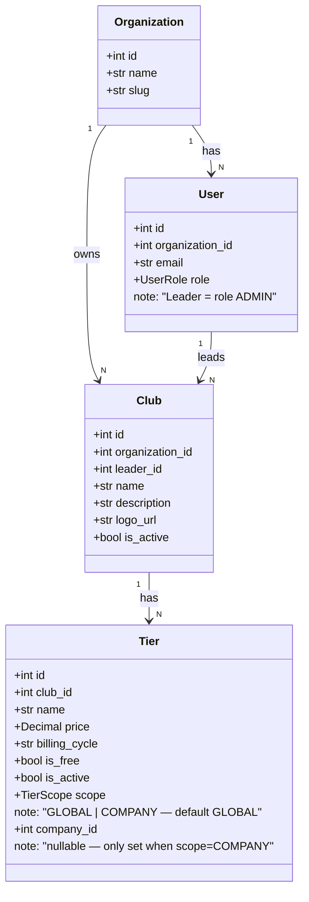
```mermaid
classDiagram
    class Organization {
        +int id
        +str name
        +str slug
    }

    class User {
        +int id
        +int organization_id
        +str email
        +UserRole role
        note: "Leader = role ADMIN"
    }

    class Club {
        +int id
        +int organization_id
        +int leader_id
        +str name
        +str description
        +str logo_url
        +bool is_active
    }

    class Tier {
        +int id
        +int club_id
        +str name
        +Decimal price
        +str billing_cycle
        +bool is_free
        +bool is_active
        +TierScope scope
        note: "GLOBAL | COMPANY — default GLOBAL"
        +int company_id
        note: "nullable — only set when scope=COMPANY"
    }

    Organization "1" --> "N" User : has
    Organization "1" --> "N" Club : owns
    User "1" --> "N" Club : leads
    Club "1" --> "N" Tier : has
```

---

## Class Diagram — Affiliates

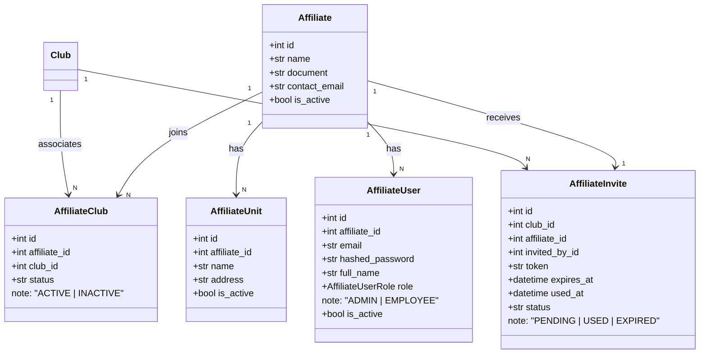
```mermaid
classDiagram
    class Affiliate {
        +int id
        +str name
        +str document
        +str contact_email
        +bool is_active
    }

    class AffiliateClub {
        +int id
        +int affiliate_id
        +int club_id
        +str status
        note: "ACTIVE | INACTIVE"
    }

    class AffiliateUnit {
        +int id
        +int affiliate_id
        +str name
        +str address
        +bool is_active
    }

    class AffiliateUser {
        +int id
        +int affiliate_id
        +str email
        +str hashed_password
        +str full_name
        +AffiliateUserRole role
        note: "ADMIN | EMPLOYEE"
        +bool is_active
    }

    class AffiliateInvite {
        +int id
        +int club_id
        +int affiliate_id
        +int invited_by_id
        +str token
        +datetime expires_at
        +datetime used_at
        +str status
        note: "PENDING | USED | EXPIRED"
    }

    Club "1" --> "N" AffiliateClub : associates
    Affiliate "1" --> "N" AffiliateClub : joins
    Affiliate "1" --> "N" AffiliateUnit : has
    Affiliate "1" --> "N" AffiliateUser : has
    Club "1" --> "N" AffiliateInvite : sends
    Affiliate "1" --> "1" AffiliateInvite : receives
```

---

## Class Diagram — Benefits

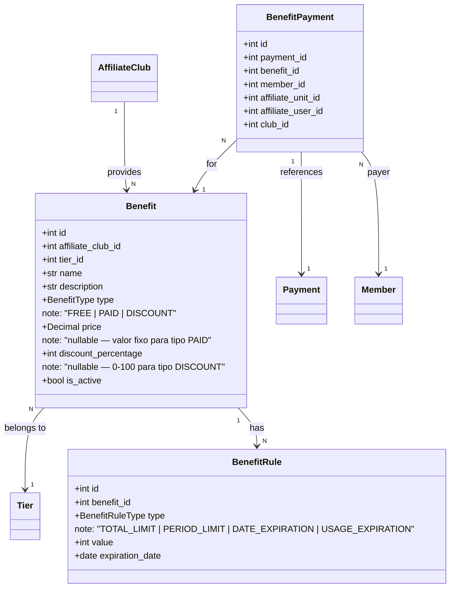
```mermaid
classDiagram
    class Benefit {
        +int id
        +int affiliate_club_id
        +int tier_id
        +str name
        +str description
        +BenefitType type
        note: "FREE | PAID | DISCOUNT"
        +Decimal price
        note: "nullable — valor fixo para tipo PAID"
        +int discount_percentage
        note: "nullable — 0-100 para tipo DISCOUNT"
        +bool is_active
    }

    class BenefitRule {
        +int id
        +int benefit_id
        +BenefitRuleType type
        note: "TOTAL_LIMIT | PERIOD_LIMIT | DATE_EXPIRATION | USAGE_EXPIRATION"
        +int value
        +date expiration_date
    }

    class BenefitPayment {
        +int id
        +int payment_id
        +int benefit_id
        +int member_id
        +int affiliate_unit_id
        +int affiliate_user_id
        +int club_id
    }

    AffiliateClub "1" --> "N" Benefit : provides
    Benefit "N" --> "1" Tier : belongs to
    Benefit "1" --> "N" BenefitRule : has
    BenefitPayment "1" --> "1" Payment : references
    BenefitPayment "N" --> "1" Benefit : for
    BenefitPayment "N" --> "1" Member : payer
```

---

## Class Diagram — Associados & Adesões

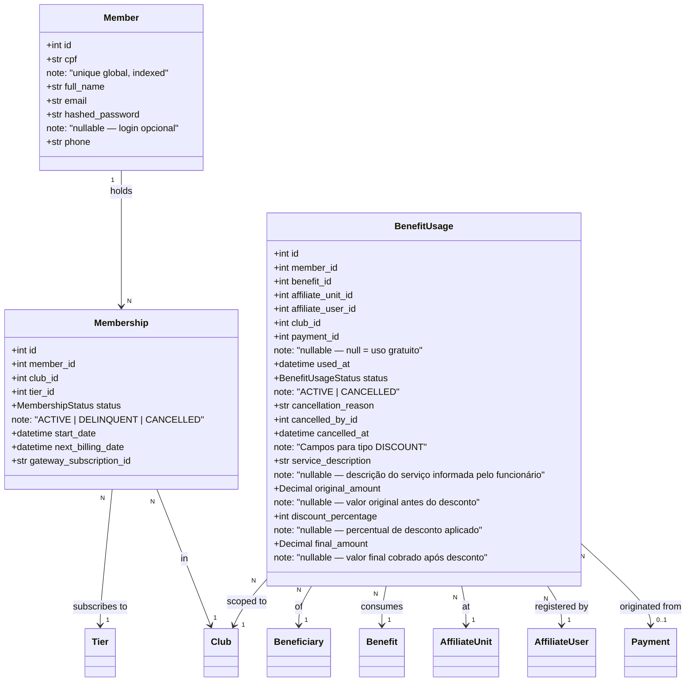
```mermaid
classDiagram
    class Member {
        +int id
        +str cpf
        note: "unique global, indexed"
        +str full_name
        +str email
        +str hashed_password
        note: "nullable — login opcional"
        +str phone
    }

    class Membership {
        +int id
        +int member_id
        +int club_id
        +int tier_id
        +MembershipStatus status
        note: "ACTIVE | DELINQUENT | CANCELLED"
        +datetime start_date
        +datetime next_billing_date
        +str gateway_subscription_id
    }

    class BenefitUsage {
        +int id
        +int member_id
        +int benefit_id
        +int affiliate_unit_id
        +int affiliate_user_id
        +int club_id
        +int payment_id
        note: "nullable — null = uso gratuito"
        +datetime used_at
        +BenefitUsageStatus status
        note: "ACTIVE | CANCELLED"
        +str cancellation_reason
        +int cancelled_by_id
        +datetime cancelled_at
        note: "Campos para tipo DISCOUNT"
        +str service_description
        note: "nullable — descrição do serviço informada pelo funcionário"
        +Decimal original_amount
        note: "nullable — valor original antes do desconto"
        +int discount_percentage
        note: "nullable — percentual de desconto aplicado"
        +Decimal final_amount
        note: "nullable — valor final cobrado após desconto"
    }

    Member "1" --> "N" Membership : holds
    Membership "N" --> "1" Tier : subscribes to
    Membership "N" --> "1" Club : in

    BenefitUsage "N" --> "1" Beneficiary : of
    BenefitUsage "N" --> "1" Benefit : consumes
    BenefitUsage "N" --> "1" AffiliateUnit : at
    BenefitUsage "N" --> "1" AffiliateUser : registered by
    BenefitUsage "N" --> "1" Club : scoped to
    BenefitUsage "N" --> "0..1" Payment : originated from
```

---

## Class Diagram — B2B (Empresas e Contratações de Pacotes)

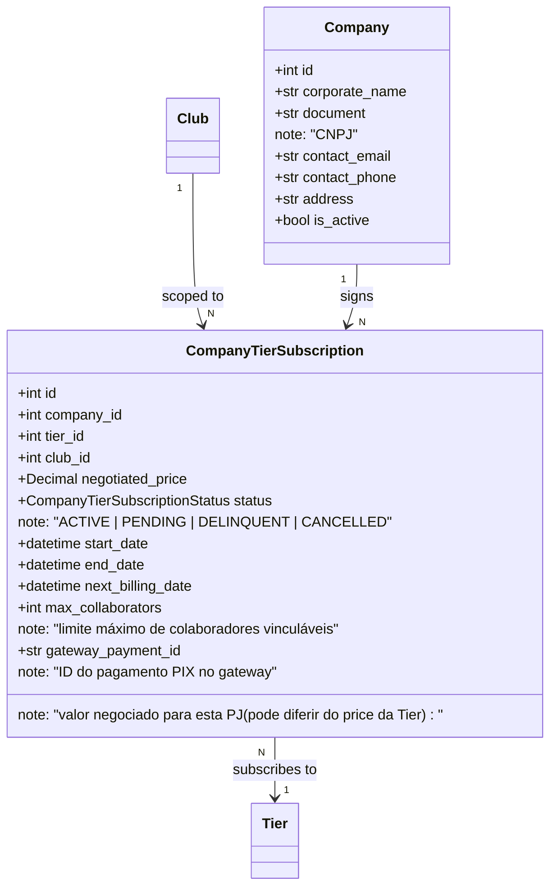
```mermaid
classDiagram
    class Company {
        +int id
        +str corporate_name
        +str document
        note: "CNPJ"
        +str contact_email
        +str contact_phone
        +str address
        +bool is_active
    }

    class CompanyTierSubscription {
        +int id
        +int company_id
        +int tier_id
        +int club_id
        +Decimal negotiated_price
        note: "valor negociado para esta PJ (pode diferir do price da Tier)"
        +CompanyTierSubscriptionStatus status
        note: "ACTIVE | PENDING | DELINQUENT | CANCELLED"
        +datetime start_date
        +datetime end_date
        +datetime next_billing_date
        +int max_collaborators
        note: "limite máximo de colaboradores vinculáveis"
        +str gateway_payment_id
        note: "ID do pagamento PIX no gateway"
    }

    Club "1" --> "N" CompanyTierSubscription : scoped to
    Company "1" --> "N" CompanyTierSubscription : signs
    CompanyTierSubscription "N" --> "1" Tier : subscribes to
```

---

## Class Diagram — Vínculo Empresa-Colaborador

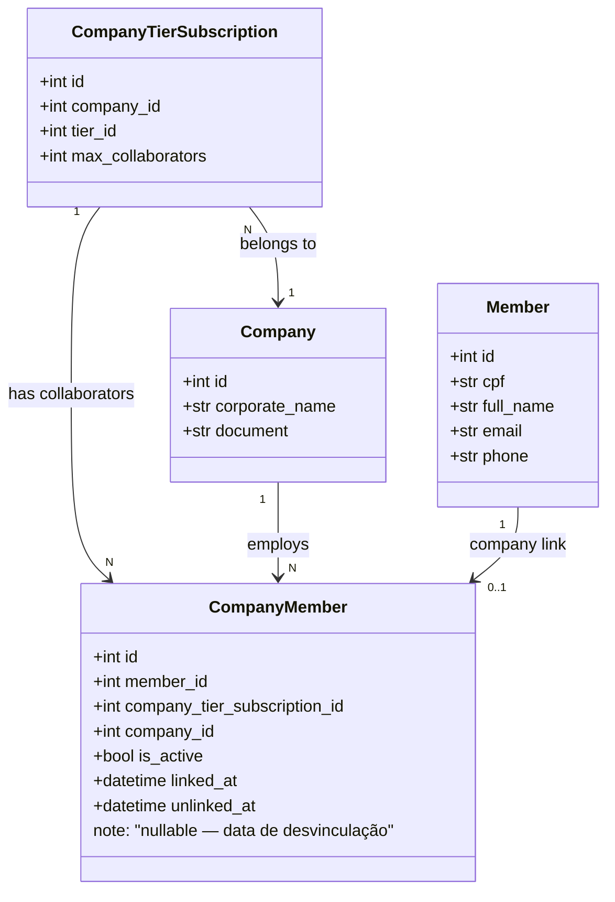
```mermaid
classDiagram
    class Company {
        +int id
        +str corporate_name
        +str document
    }

    class CompanyTierSubscription {
        +int id
        +int company_id
        +int tier_id
        +int max_collaborators
    }

    class Member {
        +int id
        +str cpf
        +str full_name
        +str email
        +str phone
    }

    class CompanyMember {
        +int id
        +int member_id
        +int company_tier_subscription_id
        +int company_id
        +bool is_active
        +datetime linked_at
        +datetime unlinked_at
        note: "nullable — data de desvinculação"
    }

    CompanyTierSubscription "1" --> "N" CompanyMember : has collaborators
    Company "1" --> "N" CompanyMember : employs
    Member "1" --> "0..1" CompanyMember : company link
    CompanyTierSubscription "N" --> "1" Company : belongs to
```

## 12. Anotações

---

## 13. Diagramas de Sequência

### SD-01 — Convite de Afiliado (RF-05 a RF-08)

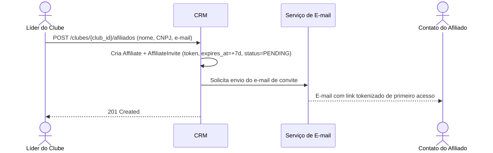
```mermaid
sequenceDiagram
    actor Lider as Líder do Clube
    participant CRM
    participant Email as Serviço de E-mail
    actor Contato as Contato do Afiliado

    Lider->>CRM: POST /clubes/{club_id}/afiliados (nome, CNPJ, e-mail)
    CRM->>CRM: Cria Affiliate + AffiliateInvite (token, expires_at=+7d, status=PENDING)
    CRM->>Email: Solicita envio do e-mail de convite
    Email-->>Contato: E-mail com link tokenizado de primeiro acesso
    CRM-->>Lider: 201 Created
```

---

### SD-02 — Primeiro Acesso do Afiliado via Convite Válido (RF-07)

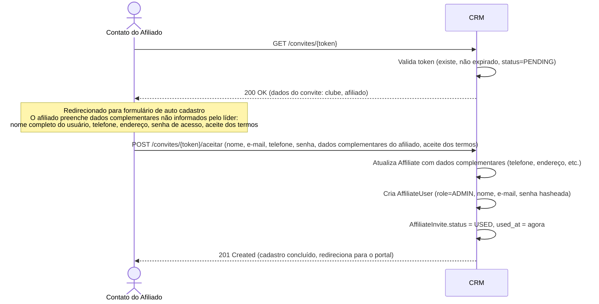
```mermaid
sequenceDiagram
    actor Contato as Contato do Afiliado
    participant CRM

    Contato->>CRM: GET /convites/{token}
    CRM->>CRM: Valida token (existe, não expirado, status=PENDING)
    CRM-->>Contato: 200 OK (dados do convite: clube, afiliado)

    Note over Contato: Redirecionado para formulário de auto cadastro<br/>O afiliado preenche dados complementares não informados pelo líder:<br/>nome completo do usuário, telefone, endereço, senha de acesso, aceite dos termos

    Contato->>CRM: POST /convites/{token}/aceitar (nome, e-mail, telefone, senha, dados complementares do afiliado, aceite dos termos)
    CRM->>CRM: Atualiza Affiliate com dados complementares (telefone, endereço, etc.)
    CRM->>CRM: Cria AffiliateUser (role=ADMIN, nome, e-mail, senha hasheada)
    CRM->>CRM: AffiliateInvite.status = USED, used_at = agora
    CRM-->>Contato: 201 Created (cadastro concluído, redireciona para o portal)
```

---

### SD-03 — Token de Convite Expirado (CA-10)

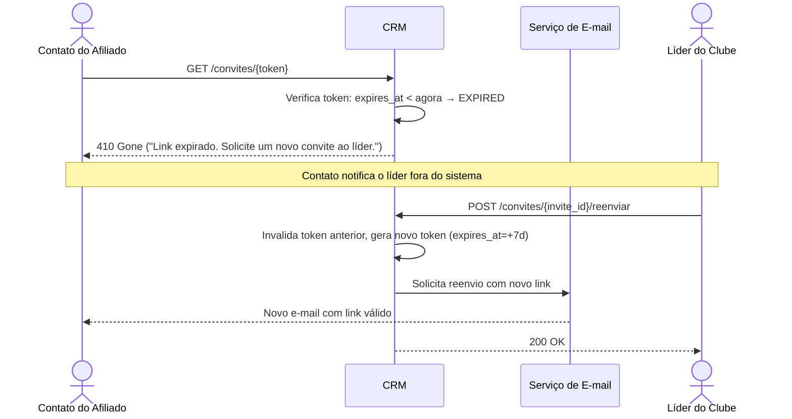
```mermaid
sequenceDiagram
    actor Contato as Contato do Afiliado
    participant CRM
    participant Email as Serviço de E-mail
    actor Lider as Líder do Clube

    Contato->>CRM: GET /convites/{token}
    CRM->>CRM: Verifica token: expires_at < agora → EXPIRED
    CRM-->>Contato: 410 Gone ("Link expirado. Solicite um novo convite ao líder.")
    Note over Contato,Lider: Contato notifica o líder fora do sistema
    Lider->>CRM: POST /convites/{invite_id}/reenviar
    CRM->>CRM: Invalida token anterior, gera novo token (expires_at=+7d)
    CRM->>Email: Solicita reenvio com novo link
    Email-->>Contato: Novo e-mail com link válido
    CRM-->>Lider: 200 OK
```

---

### SD-04 — Consulta de Associado Válido (CA-01)

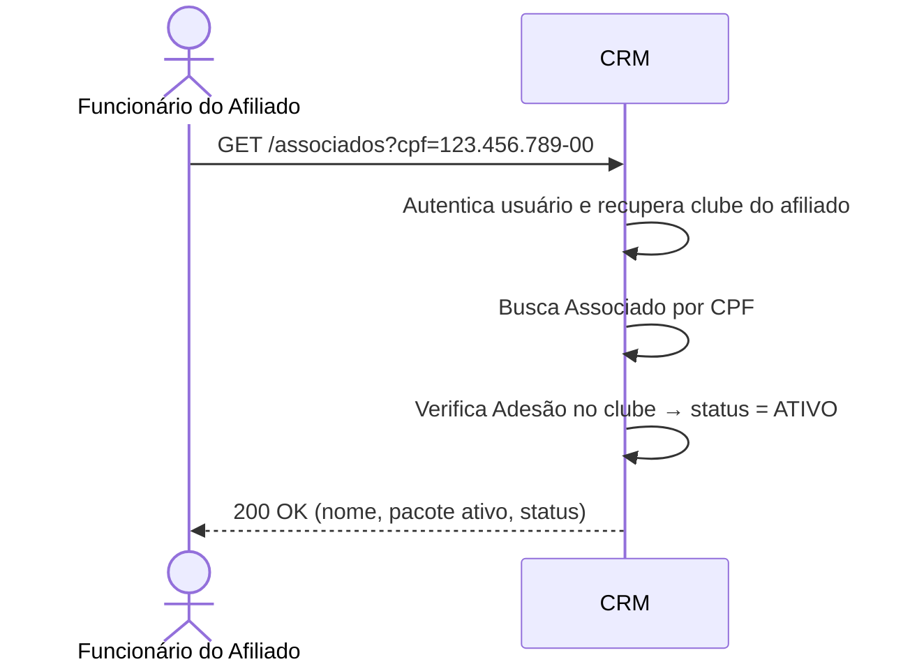
```mermaid
sequenceDiagram
    actor Func as Funcionário do Afiliado
    participant CRM

    Func->>CRM: GET /associados?cpf=123.456.789-00
    CRM->>CRM: Autentica usuário e recupera clube do afiliado
    CRM->>CRM: Busca Associado por CPF
    CRM->>CRM: Verifica Adesão no clube → status = ATIVO
    CRM-->>Func: 200 OK (nome, pacote ativo, status)
```

---

### SD-05 — Consulta de CPF sem Vínculo com o Clube (CA-02)

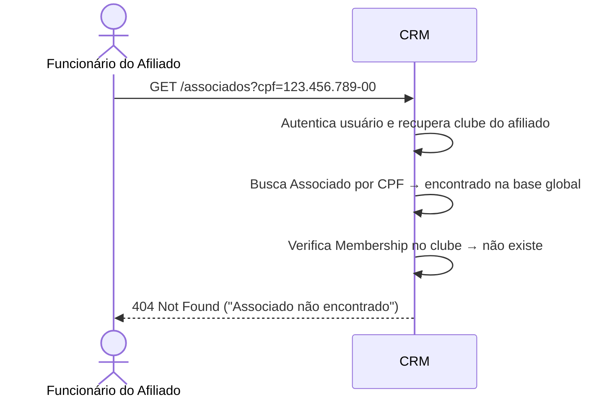
```mermaid
sequenceDiagram
    actor Func as Funcionário do Afiliado
    participant CRM

    Func->>CRM: GET /associados?cpf=123.456.789-00
    CRM->>CRM: Autentica usuário e recupera clube do afiliado
    CRM->>CRM: Busca Associado por CPF → encontrado na base global
    CRM->>CRM: Verifica Membership no clube → não existe
    CRM-->>Func: 404 Not Found ("Associado não encontrado")
```

---

### SD-06 — Registro de Uso de Benefício Gratuito (CA-03)

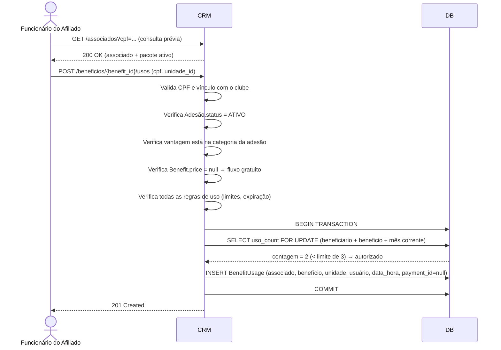
```mermaid
sequenceDiagram
    actor Func as Funcionário do Afiliado
    participant CRM
    participant DB

    Func->>CRM: GET /associados?cpf=... (consulta prévia)
    CRM-->>Func: 200 OK (associado + pacote ativo)
    Func->>CRM: POST /beneficios/{benefit_id}/usos (cpf, unidade_id)
    CRM->>CRM: Valida CPF e vínculo com o clube
    CRM->>CRM: Verifica Adesão.status = ATIVO
    CRM->>CRM: Verifica vantagem está na categoria da adesão
    CRM->>CRM: Verifica Benefit.price = null → fluxo gratuito
    CRM->>CRM: Verifica todas as regras de uso (limites, expiração)
    CRM->>DB: BEGIN TRANSACTION
    CRM->>DB: SELECT uso_count FOR UPDATE (beneficiario + beneficio + mês corrente)
    DB-->>CRM: contagem = 2 (< limite de 3) → autorizado
    CRM->>DB: INSERT BenefitUsage (associado, benefício, unidade, usuário, data_hora, payment_id=null)
    CRM->>DB: COMMIT
    CRM-->>Func: 201 Created
```

---

### SD-06b — Registro de Uso de Benefício Pago (CA-03b)

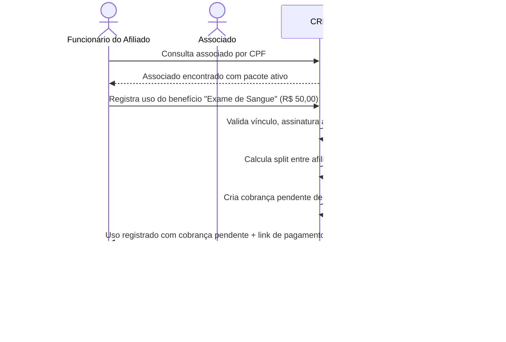
```mermaid
sequenceDiagram
    actor Func as Funcionário do Afiliado
    actor Ben as Associado
    participant CRM
    participant Med5Pay as Med5Pay (Gateway)

    Func->>CRM: Consulta associado por CPF
    CRM-->>Func: Associado encontrado com pacote ativo
    Func->>CRM: Registra uso do benefício "Exame de Sangue" (R$ 50,00)
    CRM->>CRM: Valida vínculo, assinatura ativa, tier e regras de uso
    CRM->>CRM: Calcula split entre afiliado e líder do clube
    CRM->>CRM: Cria cobrança pendente de R$ 50,00 e registra o uso
    CRM-->>Func: Uso registrado com cobrança pendente + link de pagamento
    Note over Func: Terminal exibe link de pagamento ao associado
    Ben->>Med5Pay: Efetua pagamento (Pix / cartão)
```

---

### SD-06c — Registro de Uso de Benefício com Desconto (CA-03d)

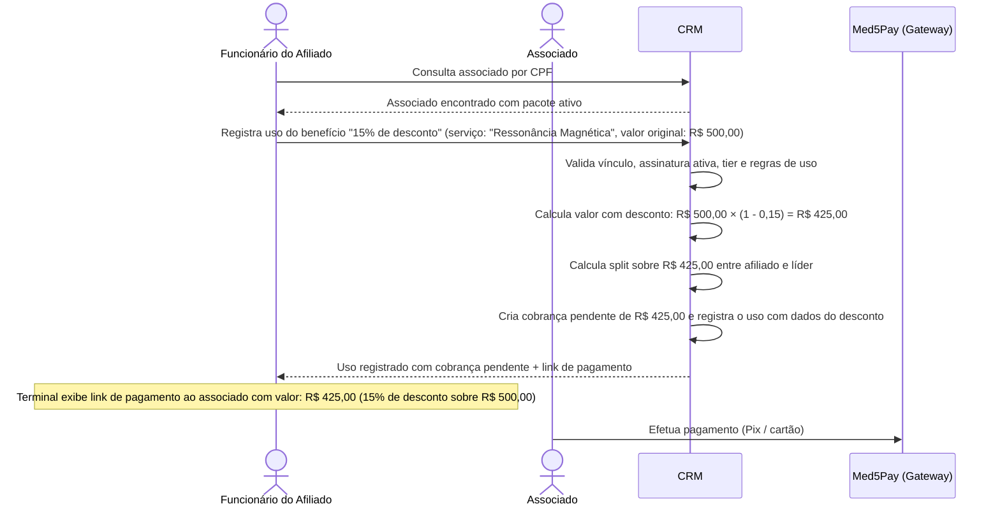
```mermaid
sequenceDiagram
    actor Func as Funcionário do Afiliado
    actor Ben as Associado
    participant CRM
    participant Med5Pay as Med5Pay (Gateway)

    Func->>CRM: Consulta associado por CPF
    CRM-->>Func: Associado encontrado com pacote ativo
    Func->>CRM: Registra uso do benefício "15% de desconto" (serviço: "Ressonância Magnética", valor original: R$ 500,00)
    CRM->>CRM: Valida vínculo, assinatura ativa, tier e regras de uso
    CRM->>CRM: Calcula valor com desconto: R$ 500,00 × (1 - 0,15) = R$ 425,00
    CRM->>CRM: Calcula split sobre R$ 425,00 entre afiliado e líder
    CRM->>CRM: Cria cobrança pendente de R$ 425,00 e registra o uso com dados do desconto
    CRM-->>Func: Uso registrado com cobrança pendente + link de pagamento
    Note over Func: Terminal exibe link de pagamento ao associado com valor: R$ 425,00 (15% de desconto sobre R$ 500,00)
    Ben->>Med5Pay: Efetua pagamento (Pix / cartão)
```

---

### SD-07 — Bloqueio de Uso por Limite Atingido (CA-04)

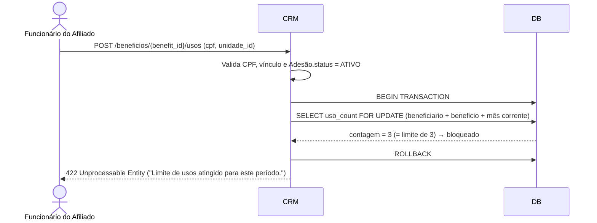
```mermaid
sequenceDiagram
    actor Func as Funcionário do Afiliado
    participant CRM
    participant DB

    Func->>CRM: POST /beneficios/{benefit_id}/usos (cpf, unidade_id)
    CRM->>CRM: Valida CPF, vínculo e Adesão.status = ATIVO
    CRM->>DB: BEGIN TRANSACTION
    CRM->>DB: SELECT uso_count FOR UPDATE (beneficiario + beneficio + mês corrente)
    DB-->>CRM: contagem = 3 (= limite de 3) → bloqueado
    CRM->>DB: ROLLBACK
    CRM-->>Func: 422 Unprocessable Entity ("Limite de usos atingido para este período.")
```

---

### SD-08 — Bloqueio de Uso por Inadimplência (CA-05)

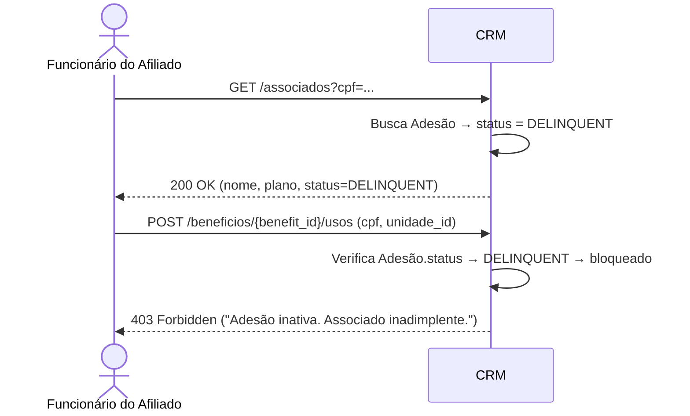
```mermaid
sequenceDiagram
    actor Func as Funcionário do Afiliado
    participant CRM

    Func->>CRM: GET /associados?cpf=...
    CRM->>CRM: Busca Adesão → status = DELINQUENT
    CRM-->>Func: 200 OK (nome, plano, status=DELINQUENT)
    Func->>CRM: POST /beneficios/{benefit_id}/usos (cpf, unidade_id)
    CRM->>CRM: Verifica Adesão.status → DELINQUENT → bloqueado
    CRM-->>Func: 403 Forbidden ("Adesão inativa. Associado inadimplente.")
```

---

### SD-09 — Controle de Concorrência no Registro de Uso (CA-06)

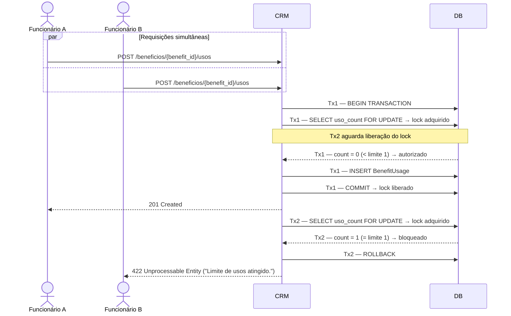
```mermaid
sequenceDiagram
    actor FuncA as Funcionário A
    actor FuncB as Funcionário B
    participant CRM
    participant DB

    par Requisições simultâneas
        FuncA->>CRM: POST /beneficios/{benefit_id}/usos
    and
        FuncB->>CRM: POST /beneficios/{benefit_id}/usos
    end

    CRM->>DB: Tx1 — BEGIN TRANSACTION
    CRM->>DB: Tx1 — SELECT uso_count FOR UPDATE → lock adquirido
    Note over CRM,DB: Tx2 aguarda liberação do lock
    DB-->>CRM: Tx1 — count = 0 (< limite 1) → autorizado
    CRM->>DB: Tx1 — INSERT BenefitUsage
    CRM->>DB: Tx1 — COMMIT → lock liberado
    CRM-->>FuncA: 201 Created

    CRM->>DB: Tx2 — SELECT uso_count FOR UPDATE → lock adquirido
    DB-->>CRM: Tx2 — count = 1 (= limite 1) → bloqueado
    CRM->>DB: Tx2 — ROLLBACK
    CRM-->>FuncB: 422 Unprocessable Entity ("Limite de usos atingido.")
```

---

### SD-10 — Exclusão de Uso com Justificativa (CA-09)

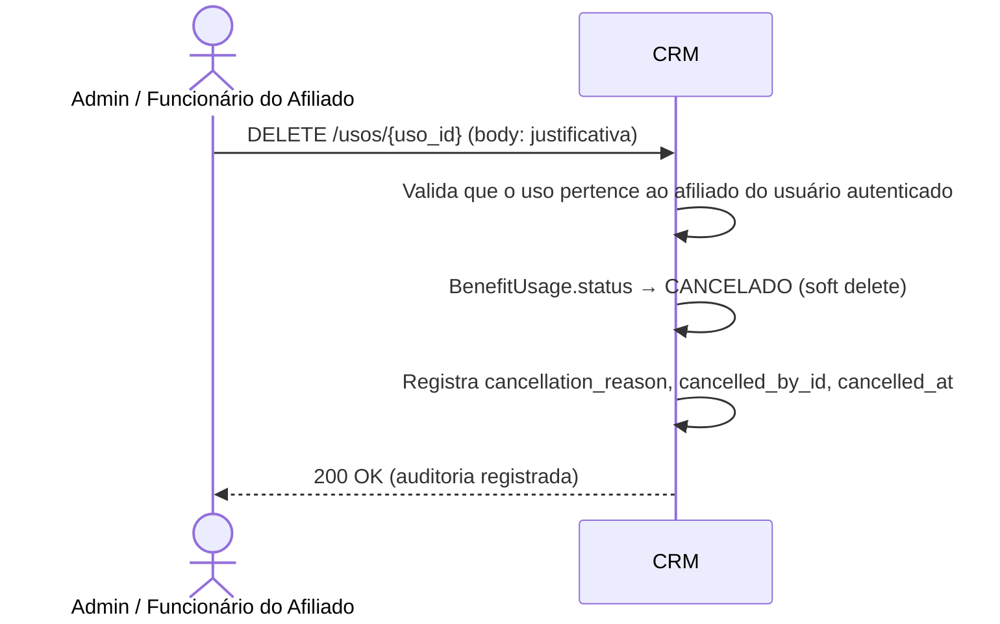
```mermaid
sequenceDiagram
    actor User as Admin / Funcionário do Afiliado
    participant CRM

    User->>CRM: DELETE /usos/{uso_id} (body: justificativa)
    CRM->>CRM: Valida que o uso pertence ao afiliado do usuário autenticado
    CRM->>CRM: BenefitUsage.status → CANCELADO (soft delete)
    CRM->>CRM: Registra cancellation_reason, cancelled_by_id, cancelled_at
    CRM-->>User: 200 OK (auditoria registrada)
```

---

### SD-11 — Contratação de Pacote pelo Associado

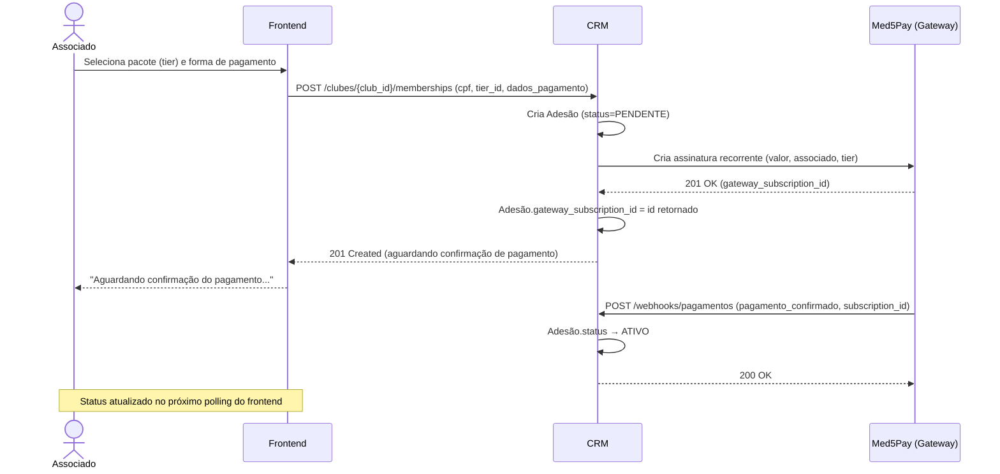
```mermaid
sequenceDiagram
    actor Ben as Associado
    participant Frontend
    participant CRM
    participant Med5Pay as Med5Pay (Gateway)

    Ben->>Frontend: Seleciona pacote (tier) e forma de pagamento
    Frontend->>CRM: POST /clubes/{club_id}/memberships (cpf, tier_id, dados_pagamento)
    CRM->>CRM: Cria Adesão (status=PENDENTE)
    CRM->>Med5Pay: Cria assinatura recorrente (valor, associado, tier)
    Med5Pay-->>CRM: 201 OK (gateway_subscription_id)
    CRM->>CRM: Adesão.gateway_subscription_id = id retornado
    CRM-->>Frontend: 201 Created (aguardando confirmação de pagamento)
    Frontend-->>Ben: "Aguardando confirmação do pagamento..."
    Med5Pay->>CRM: POST /webhooks/pagamentos (pagamento_confirmado, subscription_id)
    CRM->>CRM: Adesão.status → ATIVO
    CRM-->>Med5Pay: 200 OK
    Note over Frontend,Ben: Status atualizado no próximo polling do frontend
```

---

### SD-12 — Ativação de Assinatura via Webhook (CA-07)

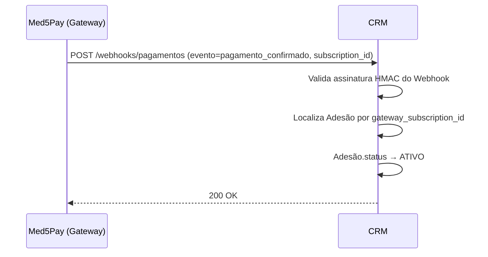
```mermaid
sequenceDiagram
    participant Med5Pay as Med5Pay (Gateway)
    participant CRM

    Med5Pay->>CRM: POST /webhooks/pagamentos (evento=pagamento_confirmado, subscription_id)
    CRM->>CRM: Valida assinatura HMAC do Webhook
    CRM->>CRM: Localiza Adesão por gateway_subscription_id
    CRM->>CRM: Adesão.status → ATIVO
    CRM-->>Med5Pay: 200 OK
```

---

### SD-13 — Inadimplência via Async Task (CA-08)

```mermaid
sequenceDiagram
    participant Cron as Async Task (03h00)
    participant CRM
    participant Email as Serviço de E-mail
    actor Ben as Associado

    Cron->>CRM: Inicia verificação diária de vencimentos
    CRM->>CRM: SELECT Adesões WHERE status=ATIVO AND next_billing_date < hoje
    loop Para cada assinatura vencida
        CRM->>CRM: Adesão.status → DELINQUENT
        CRM->>Email: Solicita notificação ao associado
        Email-->>Ben: Notificação de inadimplência
    end
    CRM-->>Cron: Tarefa concluída (N assinaturas atualizadas)
```

---

### SD-14 — Confirmação de Pagamento de Benefício Pago via Webhook (CA-03c)

```mermaid
sequenceDiagram
    actor Ben as Associado
    actor Func as Funcionário do Afiliado
    participant CRM
    participant Med5Pay as Med5Pay (Gateway)
    actor Afiliado as Afiliado (prestador)
    actor Lider as Líder do Clube

    Note over Func,Med5Pay: SD-06b já realizou: uso registrado com cobrança pendente
    Ben->>Med5Pay: Efetua pagamento (Pix / cartão)
    Med5Pay->>CRM: Notifica pagamento confirmado
    CRM->>CRM: Atualiza status da cobrança para "pago"
    CRM-->>Med5Pay: Confirmação recebida
    loop Terminal consulta status até confirmação
        Func->>CRM: Consulta status do pagamento
        CRM-->>Func: Cobrança paga
    end
    Note over Func: Terminal exibe confirmação ao associado
    par Repasse automático pelo Med5Pay
        Med5Pay-->>Afiliado: Transferência da parcela do afiliado
    and
        Med5Pay-->>Lider: Transferência da parcela do líder
    end
```

---

### SD-14b — Confirmação de Pagamento de Benefício com Desconto via Webhook (CA-03e)

```mermaid
sequenceDiagram
    actor Ben as Associado
    actor Func as Funcionário do Afiliado
    participant CRM
    participant Med5Pay as Med5Pay (Gateway)
    actor Afiliado as Afiliado (prestador)
    actor Lider as Líder do Clube

    Note over Func,Med5Pay: SD-06c já realizou: uso registrado com cobrança pendente e dados do desconto
    Ben->>Med5Pay: Efetua pagamento (Pix / cartão)
    Med5Pay->>CRM: Notifica pagamento confirmado
    CRM->>CRM: Atualiza status da cobrança para "pago"
    CRM-->>Med5Pay: Confirmação recebida
    loop Terminal consulta status até confirmação
        Func->>CRM: Consulta status do pagamento
        CRM-->>Func: Cobrança paga
    end
    Note over Func: Terminal exibe confirmação ao associado com resumo do desconto aplicado
    par Repasse automático pelo Med5Pay sobre o valor final (R$ 425,00)
        Med5Pay-->>Afiliado: Transferência da parcela do afiliado
    and
        Med5Pay-->>Lider: Transferência da parcela do líder
    end
```

---

### SD-15 — Criação de Assinatura de Pacote Corporativo (RF-54, RF-55, RF-57)

```mermaid
sequenceDiagram
    actor Lider as Líder do Clube
    participant CRM
    participant Med5Pay as Med5Pay (Gateway)

    alt Tier existente (escopo GLOBAL)
        Lider->>CRM: POST /empresas/{company_id}/contratacoes-de-pacote (tier_id, valor_negociado, vigência, max_colaboradores)
        CRM->>CRM: Cria CompanyTierSubscription (status=ACTIVE, negotiated_price, max_collaborators)
    else Tier exclusiva necessária
        Lider->>CRM: POST /clubes/{club_id}/tiers (nome, vantagens, regras, scope=COMPANY, company_id)
        CRM->>CRM: Cria Tier exclusiva com seus Benefits
        Lider->>CRM: POST /empresas/{company_id}/contratacoes-de-pacote (tier_id=novo_tier_id, valor_negociado, vigência, max_colaboradores)
        CRM->>CRM: Cria CompanyTierSubscription vinculada à Tier exclusiva
    end

    CRM->>Med5Pay: Gera cobrança PIX (valor negociado, sem split, validade=7 dias)
    Med5Pay-->>CRM: 201 OK (gateway_payment_id, QR Code PIX, expires_at=+7d)
    CRM-->>Lider: 201 Created (assinatura criada + QR Code PIX com validade de 7 dias)
```

---

### SD-16 — Confirmação de Pagamento e Ativação de Contratação de Pacote (RF-58 a RF-60a, CA-15)

```mermaid
sequenceDiagram
    actor Lider as Líder do Clube
    participant CRM
    participant Med5Pay as Med5Pay (Gateway)
    actor Empresa as Empresa (PJ)

    Note over Lider: SD-15 já realizou: assinatura criada com QR Code PIX

    Lider->>Lider: Encaminha QR Code à Empresa
    Empresa->>Med5Pay: Realiza pagamento PIX (dentro dos 7 dias)
    Med5Pay->>CRM: POST /webhooks/pagamentos (pagamento_confirmado, payment_id)
    CRM->>CRM: Localiza CompanyTierSubscription por gateway_payment_id
    CRM->>CRM: Atualiza data de vigência (end_date, next_billing_date)
    CRM-->>Med5Pay: 200 OK
    Note over CRM: Pagamento confirmado — ciclo de vigência iniciado. Valor integral ao Líder (sem split).
```

---

### SD-17 — Cadastro de Colaborador (RF-66 a RF-69, CA-11, CA-12, CA-13)

```mermaid
sequenceDiagram
    actor Lider as Líder do Clube
    participant CRM

    Lider->>CRM: POST /contratacoes-de-pacote/{subscription_id}/colaboradores (cpf, nome_completo)
    CRM->>CRM: Busca Associado por CPF

    alt CPF já possui adesão ativa como independente (CA-11)
        CRM-->>Lider: 409 Conflict ("CPF já possui assinatura ativa")
    else CPF livre ou não existente
        CRM->>CRM: Cria ou reutiliza Associado
        CRM->>CRM: Verifica limite de colaboradores da CompanyTierSubscription
        alt Limite atingido (CA-13)
            CRM-->>Lider: 422 Unprocessable Entity ("Limite de colaboradores atingido")
        else Limite disponível (CA-12)
            CRM->>CRM: Cria CompanyMember (vínculo automático com a Contratação de Pacote)
            CRM-->>Lider: 201 Created (colaborador vinculado com sucesso)
        end
    end
```

---

### SD-18 — Uso de Benefício por Colaborador (CA-16)

```mermaid
sequenceDiagram
    actor Func as Funcionário do Afiliado
    participant CRM
    participant DB

    Func->>CRM: GET /associados?cpf=987.654.321-00
    CRM->>CRM: Busca Associado por CPF
    CRM->>CRM: Verifica vínculo com Empresa via CompanyBeneficiary
    CRM->>CRM: Verifica CompanyTierSubscription.status = ACTIVE
    CRM-->>Func: 200 OK (nome, Empresa vinculada, Categoria da Contratação de Pacote)

    Func->>CRM: POST /beneficios/{benefit_id}/usos (cpf, unidade_id)
    CRM->>CRM: Valida CPF e vínculo com o clube
    CRM->>CRM: Verifica ContratacaoPacote.status = ACTIVE (RF-74)
    CRM->>CRM: Verifica vantagem está na Categoria da Contratação de Pacote
    CRM->>CRM: Verifica todas as regras de uso (limites, expiração)
    CRM->>DB: BEGIN TRANSACTION
    CRM->>DB: SELECT uso_count FOR UPDATE (colaborador + beneficio + período)
    DB-->>CRM: contagem dentro do limite → autorizado
    CRM->>DB: INSERT BenefitUsage (colaborador, vantagem, unidade, empresa_vinculada)
    CRM->>DB: COMMIT
    CRM-->>Func: 201 Created (registro exibe Empresa vinculada)
```

---

### SD-19 — Bloqueio Cascata por Inadimplência da Contratação de Pacote (CA-14, RF-60a)

```mermaid
sequenceDiagram
    participant Cron as Async Task (03h00)
    participant CRM

    Cron->>CRM: Inicia verificação diária de assinaturas com fatura vencida
    CRM->>CRM: SELECT CompanyTierSubscriptions WHERE status=ACTIVE AND pix_expires_at < agora

    Note over CRM: Somente assinaturas cuja fatura PIX ultrapassou os 7 dias<br/>de validade sem pagamento confirmado são selecionadas.

    loop Para cada assinatura com fatura PIX vencida
        CRM->>CRM: CompanyTierSubscription.status → DELINQUENT
        Note over CRM: Bloqueio cascata automático — todos os colaboradores vinculados<br/>têm acesso bloqueado. Nenhuma alteração individual necessária.
    end

    CRM-->>Cron: Tarefa concluída (N assinaturas atualizadas)

    Note over CRM: Na próxima consulta de uso por CPF:<br/>1. Sistema identifica vínculo com Empresa via CompanyBeneficiary<br/>2. Verifica CompanyTierSubscription.status = DELINQUENT<br/>3. Retorna erro — benefícios bloqueados
```

---

### SD-20 — Renovação da Contratação de Pacote via PIX (CA-15, RF-60)

```mermaid
sequenceDiagram
    participant Cron as Async Task
    participant CRM
    participant Med5Pay as Med5Pay (Gateway)
    actor Empresa as Empresa (PJ)
    actor Lider as Líder do Clube

    Note over Cron,CRM: Contratação de Pacote próxima do vencimento do ciclo

    Cron->>CRM: Verifica CompanyTierSubscriptions com next_billing_date próximo
    CRM->>Med5Pay: Gera fatura PIX de renovação (valor negociado, validade=7 dias, sem split)
    Med5Pay-->>CRM: 201 OK (gateway_payment_id, QR Code PIX, expires_at=+7d)
    CRM->>CRM: CompanyTierSubscription.status → ACTIVE (permanece ativo durante os 7 dias)
    Note over CRM: Colaboradores mantêm acesso durante o período de validade da fatura

    alt Pagamento dentro dos 7 dias
        Empresa->>Med5Pay: Realiza pagamento PIX
        Med5Pay->>CRM: POST /webhooks/pagamentos (pagamento_confirmado, payment_id)
        CRM->>CRM: Valida assinatura HMAC do Webhook
        CRM->>CRM: Localiza CompanyTierSubscription por gateway_payment_id
        CRM->>CRM: Atualiza end_date e next_billing_date (novo ciclo de vigência)
        CRM-->>Med5Pay: 200 OK
        Note over CRM: Valor integral creditado ao Líder (sem split)
        par Repasse integral pelo Med5Pay
            Med5Pay-->>Lider: Transferência integral do valor negociado
        end
    else Fatura PIX vencida sem pagamento (após 7 dias)
        Note over CRM: SD-19 — Bloqueio cascata por inadimplência
    end
```

O mapa do site descreve as telas que compõem o sistema, organizadas por ator. Cada tela lista as ações disponíveis para o usuário naquele contexto.

---

### 14.1 Líder do Clube (Painel Administrativo)

```
Painel Administrativo
│
├── [Comum]
│   ├── Dashboard
│   │   └── Visão geral do clube: total de associados ativos, receita do mês,
│   │       afiliados cadastrados, usos de benefícios no período e alertas de inadimplência.
│   ├── Clubes
│   │   ├── Lista de Clubes
│   │   │   └── Visualizar todos os clubes gerenciados pelo líder com status e métricas resumidas.
│   │   ├── Criar Clube
│   │   │   └── Definir nome, descrição e logo para novos clubes.
│   │   └── Editar Clube
│   │       └── Alterar nome, descrição e logo. Ativar ou desativar o clube.
│   ├── Afiliados
│   │   ├── Lista de Afiliados
│   │   │   └── Visualizar todos os afiliados do clube com status do vínculo (ativo/inativo).
│   │   ├── Convidar Afiliado
│   │   │   └── Cadastrar nome, CNPJ, e-mail de contato e percentual de split do líder para o afiliado. O sistema dispara o convite.
│   │   ├── Reenviar Convite
│   │   │   └── Gerar novo token e reenviar e-mail para afiliados com convite expirado.
│   │   └── Detalhe do Afiliado
│   │       └── Visualizar unidades cadastradas, usuários, percentual de split e benefícios que o afiliado oferece no clube.
│   ├── Benefícios
│   │   ├── Lista de Benefícios
│   │   │   └── Visualizar todos os benefícios do clube com tipo (gratuito/pago/desconto), tier e afiliado.
│   │   ├── Criar Benefício
│   │   │   └── Definir nome, descrição, tipo (gratuito, pago ou desconto), valor ou percentual,
│   │   │       afiliado prestador, tier de acesso e regras de uso (limites, períodos, expiração).
│   │   ├── Editar Benefício
│   │   │   └── Alterar dados do benefício. Ativar ou desativar.
│   │   └── Detalhe do Benefício
│   │       └── Visualizar regras configuradas, histórico de usos e relatório de consumo.
│   └── Relatórios Consolidados
│       ├── Uso por Afiliado
│       │   └── Consolidado de usos de benefícios agrupados por afiliado no período selecionado.
│       ├── Uso por Unidade
│       │   └── Consolidado de usos agrupados por unidade do afiliado.
│       ├── Uso por Tipo de Benefício
│       │   └── Consolidado de usos agrupados por tipo de benefício (gratuito, pago, desconto).
│       ├── Receita por Clube
│       │   └── Receita total do clube com base em assinaturas ativas e seus valores de tier.
│       ├── Receita por Tier
│       │   └── Receita detalhada por categoria, com quantidade de adesões e valor total gerado.
│       └── Histórico de Pagamentos de Serviços
│           └── Listagem de pagamentos avulsos realizados no clube com valor total e split recebido.
│
├── [B2C]
│   ├── Categorias (Tiers)
│   │   ├── Lista de Tiers
│   │   │   └── Visualizar todos os tiers do clube com preço, ciclo de cobrança e status.
│   │   ├── Criar Tier
│   │   │   └── Definir nome, preço, ciclo de cobrança (mensal/anual) e se é gratuito.
│   │   ├── Editar Tier
│   │   │   └── Alterar informações do tier. Ativar ou desativar.
│   │   └── Detalhe do Tier
│   │       └── Visualizar benefícios vinculados ao tier e quantidade de adesões ativas.
│   ├── Associados
│   │   ├── Lista de Associados
│   │   │   └── Visualizar todos os associados com adesão no clube, filtrar por status
│   │   │       (ativo, inadimplente, cancelado) e buscar por CPF ou nome.
│   │   │       Para colaboradores, exibir a empresa (PJ) e a contratação de pacote às quais estão vinculados.
│   │   └── Detalhe do Associado
│   │       └── Visualizar dados pessoais, pacote ativo, histórico de usos e histórico de pagamentos.
│   │           Para colaboradores, exibir empresa vinculada e contratação de pacote associada.
│   └── Relatórios B2C
│       └── (relatórios consolidados listados em [Comum])
│
└── [B2B]
    ├── Empresas (PJ)
    │   ├── Lista de Empresas
    │   │   └── Visualizar todas as empresas cadastradas com quantidade de colaboradores vinculados,
    │   │       contratações de pacotes ativas e vigência.
    │   ├── Cadastrar Empresa
    │   │   └── Informar razão social, CNPJ, e-mail de contato, telefone e endereço.
    │   ├── Editar Empresa
    │   │   └── Alterar dados cadastrais da empresa. Ativar ou desativar.
    │   └── Detalhe da Empresa
    │       └── Visualizar dados da empresa, lista de contratações de pacotes,
    │           lista de colaboradores vinculados por assinatura, status das assinaturas
    │           e histórico de pagamentos.
    ├── Pacotes Corporativos (Tiers B2B)
    │   ├── Lista de Pacotes Corporativos
    │   │   └── Visualizar todas as categorias disponíveis para B2B (GLOBAL + COMPANY),
    │   │       com escopo, valor, vantagens incluídas e quantidade de contratações ativas.
    │   ├── Criar Pacote Corporativo (Tier)
    │   │   └── Definir nome, escopo (GLOBAL ou COMPANY), valor, ciclo de cobrança,
    │   │       benefícios incluídos. Se escopo COMPANY, selecionar a empresa vinculada.
    │   ├── Editar Pacote Corporativo
    │   │   └── Alterar dados do plano. Ativar ou desativar.
    │   ├── Contratar Pacote para Empresa
    │   │   └── Criar CompanyTierSubscription: vincular um Pacote (Categoria) a uma Empresa (PJ),
    │   │       definir valor negociado, vigência e limite máximo de colaboradores.
    │   │       Gera cobrança PIX para a PJ.
    │   ├── Gerenciar Colaboradores
    │   │   └── Cadastrar colaboradores vinculados a uma contratação de pacote específica.
    │   │       Informar CPF, nome completo. Vínculo automático com a assinatura.
    │   │       O sistema impede cadastro quando o limite de colaboradores é atingido.
    │   └── Detalhe da Contratação de Pacote
    │       └── Visualizar dados da assinatura, empresa vinculada,
    │           categoria contratada, status, lista de colaboradores vinculados e histórico de pagamentos.
    └── Relatórios B2B
        ├── Uso por Empresa (PJ)
        │   └── Consolidado de usos de colaboradores agrupados por Empresa (PJ),
        │       permitindo visualizar consumo por empresa e por colaborador.
        └── Receita B2B
            └── Receita total de contratações de pacotes corporativos ativos, com detalhamento por empresa
                e valor negociado. Não inclui split (valor integral ao Líder).
```

---

### 14.2 Usuário do Afiliado — Admin

```
Portal do Afiliado (Admin)
│
├── Dashboard
│   └── Resumo do afiliado: total de usos no período, usos por unidade e alertas pendentes.
│
├── Unidades
│   ├── Lista de Unidades
│   │   └── Visualizar todas as unidades do afiliado com endereço e status.
│   ├── Criar Unidade
│   │   └── Cadastrar nome e endereço de nova filial ou ponto de atendimento.
│   └── Editar Unidade
│       └── Alterar dados da unidade. Ativar ou desativar.
│
├── Usuários
│   ├── Lista de Usuários
│   │   └── Visualizar todos os usuários do afiliado com papel (Admin ou Funcionário) e status.
│   ├── Criar Usuário
│   │   └── Cadastrar nome, e-mail e papel (Admin ou Funcionário) para novo usuário do afiliado.
│   └── Editar Usuário
│       └── Alterar papel ou dados do usuário. Ativar ou desativar acesso.
│
├── Resgate de Benefícios
│   ├── Consultar Associado por CPF
│   │   └── Buscar associado por CPF e visualizar nome, pacote ativo e status da adesão.
│   │       Somente associados com vínculo ativo no clube do afiliado são exibidos.
│   └── Registrar Uso de Benefício
│       └── Selecionar vantagem disponível no pacote do associado, informar a unidade de
│           atendimento e confirmar o uso. Para benefícios pagos ou com desconto, o sistema
│           gera o QR Code de pagamento via Med5Pay. Para desconto, informar valor original
│           e descrição do serviço.
│
├── Histórico de Usos
│   ├── Lista de Usos
│   │   └── Visualizar todos os usos registrados pelo afiliado com filtros por período,
│   │       unidade, benefício e status (ativo/cancelado).
│   └── Excluir Uso
│       └── Cancelar um registro de uso indevido informando justificativa obrigatória.
│           O registro é mantido com status CANCELADO (soft delete).
│
└── Relatórios
    ├── Uso por Unidade
    │   └── Consolidado de usos restritos ao próprio afiliado, agrupados por unidade.
    └── Uso por Benefício
        └── Consolidado de usos restritos ao próprio afiliado, agrupados por tipo de benefício.
```

---

### 14.3 Usuário do Afiliado — Funcionário

```
Portal do Afiliado (Funcionário)
│
└── Resgate de Benefícios
    ├── Consultar Associado por CPF
    │   └── Buscar associado por CPF e visualizar nome, pacote ativo e status da adesão.
    │       Somente associados com vínculo ativo no clube do afiliado são exibidos.
    │       Associados sem vínculo retornam erro genérico (sem revelar existência do registro).
    ├── Registrar Uso de Benefício
    │   └── Selecionar vantagem disponível no pacote do associado, informar a unidade de
    │       atendimento e confirmar o uso. Para benefícios pagos, o sistema gera o QR Code
    │       de pagamento. Para desconto, informar o valor original e a descrição do serviço.
    │       O sistema calcula e exibe o valor final com desconto antes da confirmação.
    └── Cancelar Uso Registrado
        └── Cancelar um registro de uso com justificativa obrigatória. O registro é mantido
            com status CANCELADO para fins de auditoria.
```

---

### 14.4 Associado (Portal Externo)

```
Portal do Associado (consumido via API REST)
│
├── Autenticação
│   └── Login com e-mail e senha. Acesso restrito ao escopo do clube em questão.
│
├── Dashboard
│   └── Visão geral: pacote ativo, status da adesão, próxima data de cobrança
│       e resumo de usos recentes no mês corrente.
│
├── Meu Pacote
│   ├── Pacote Ativo
│   │   └── Visualizar nome da categoria, preço, ciclo de cobrança, vantagens incluídas
│   │       e status atual da adesão (ativo, inadimplente, cancelado).
│   ├── Aderir ao Pacote
│   │   └── Selecionar uma categoria disponível no clube, escolher forma de pagamento e
│   │       confirmar assinatura. A ativação ocorre após confirmação via webhook do gateway.
│   └── Mudar de Categoria
│       └── Selecionar nova categoria e confirmar a migração. A mudança é processada
│           conforme política do clube (sem pro-rata nesta versão).
│
├── Histórico de Usos
│   └── Listagem de todos os usos de benefícios realizados pelo associado,
│       com data, local (unidade do afiliado), benefício utilizado e status.
│
└── Pagamento de Serviços
    ├── Iniciar Pagamento
    │   └── Selecionar serviço oferecido por um afiliado do clube e realizar pagamento
    │       avulso via Med5Pay (independente da assinatura). O split é aplicado
    │       automaticamente entre o afiliado e o líder do clube.
    └── Histórico de Pagamentos
        └── Visualizar todos os pagamentos avulsos realizados com status e valores.
```
